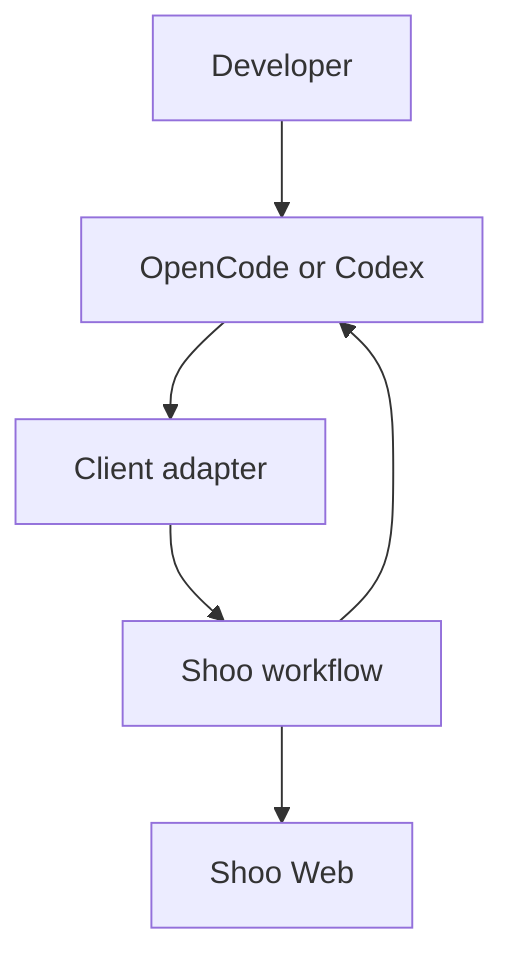

# Shoo Service Blueprint and Agent Interaction Map

- Version: 0.2
- Status: Accepted — Decision Gate 2
- Owner role: Principal UX Architect / Staff Software Architect
- Dependencies: Scenario Workflows; User Journeys
- Assumptions: Local capture and policy evaluation exist as a product boundary; exact process/container design is deferred
- Unresolved questions: Which policy checks must execute locally; which UI owns ambiguity resolution
- Last decision: Sponsor approved client-specific adapters and explicit capture completeness
- Next action: Use the blueprint to identify Phase 3 product capabilities without fixing container architecture

## Service blueprint — resume work unit

| Layer | Start | Work | Checkpoint/stop | Resume in another agent | Correct |
|---|---|---|---|---|---|
| User action | Opens linked project and client | Codes normally | Stops, compacts, blocks, or explicitly checkpoints | Opens second client | Reviews and corrects a claim |
| Agent-visible frontstage | Receives scoped context and citations | Can call Shoo tools when needed | Reports outcome where available | Receives continuation pack | Receives corrected context |
| Human-visible frontstage | Shows work-unit match and capture health | Shows unobtrusive sync state | Shows checkpoint outcome and durable queue state | Shows sources/freshness on demand | Shows lineage and affected answers |
| Local backstage | Identifies project/client/session; evaluates local policy | Normalizes events; filters secrets/exclusions | Builds partial evidence bundle; queues sync | Confirms repo/worktree state | Applies local restriction/deletion actions |
| Cloud backstage | Resolves work unit and permitted current state | Maintains operational progress and extraction jobs | Creates candidates; evaluates authority; schedules durable write | Retrieves/ranks and builds token-bounded pack | Supersedes memory; invalidates packs/index entries |
| Durable dependency | Reads permitted durable state when relevant | Usually no synchronous write per event | Persists policy-selected memory asynchronously | Supplies durable evidence or restore path | Applies supported recall removal/retention behavior |
| Evidence | Client event, repo state, prior memory | Tool/file/test events | Checkpoint sources and outcome claim | Pack manifest and citations | Correction/supersession event |
| Recovery | Explicit work-unit selection | Capture degradation warning | Operational outbox if durable layer unavailable | Last safe pack plus freshness warning | Preserve history; regenerate affected outputs |

## Agent interaction map

Interaction rules:

- Developer authority is evaluated separately from client identity.
- Client adapters produce evidence and request context; they do not declare canonical truth.
- Shoo Web and agent surfaces must show the same authority and supersession semantics.
- MemWal/Walrus is behind Shoo policy and does not communicate product truth directly to clients.

## OpenCode capability interpretation

| Client signal | Shoo interpretation | Must not infer automatically |
|---|---|---|
| `session.created` | Candidate session start | Work unit is new |
| `session.updated` | Session metadata changed | Meaningful progress occurred |
| `session.compacted` | Checkpoint opportunity | Summary is verified truth |
| `session.idle` | Agent is currently idle | Session or task completed |
| `session.error` | Capture failure/interruption evidence | Work was lost completely |
| `file.edited` | Observed file-change evidence | Change is correct or committed |
| `tool.execute.after` | Observed tool result | Agent interpretation is correct |
| `todo.updated` | Working-plan signal | Canonical project task state |

## Codex capability interpretation

| Hook | Shoo interpretation | Must not infer automatically |
|---|---|---|
| `SessionStart` | Candidate start/resume | Correct work unit was selected |
| `PostToolUse` | Tool evidence | Tool outcome completed the task |
| `PreCompact` | High-value checkpoint boundary | Generated compact summary is authoritative |
| `PostCompact` | Compaction occurred | No context was lost |
| `Stop` | Turn/session stopping boundary | Work unit completed |

## Visibility and authority separation

| Example | Visibility | Authority |
|---|---|---|
| Personal experiment | Personal | Working claim |
| Test output on branch | Project or personal by policy | Verified observation for that branch |
| Agent architecture recommendation | Allowed readers | Proposal |
| Maintainer-accepted ADR | Project/team | Accepted decision; possibly canonical |
| Superseded decision | Historical readers | No longer current |

Making data visible never automatically makes it canonical. Making it canonical never grants broader visibility than permission allows.

## Failure walkthroughs

### Durable layer unavailable

Local capture and cloud operational state continue. Durable candidates enter an observable retry queue. Context packs may use verified operational state with a durability warning. Coding is not blocked.

### Out-of-order client events

Shoo retains source timestamps, ingestion timestamps, sequence/correlation identifiers, and recalculates derived state. It does not overwrite by arrival order alone.

### Permission revoked

Future retrieval and packs exclude revoked data. Cached packs are invalidated. Audit evidence records the policy change without exposing protected content.
