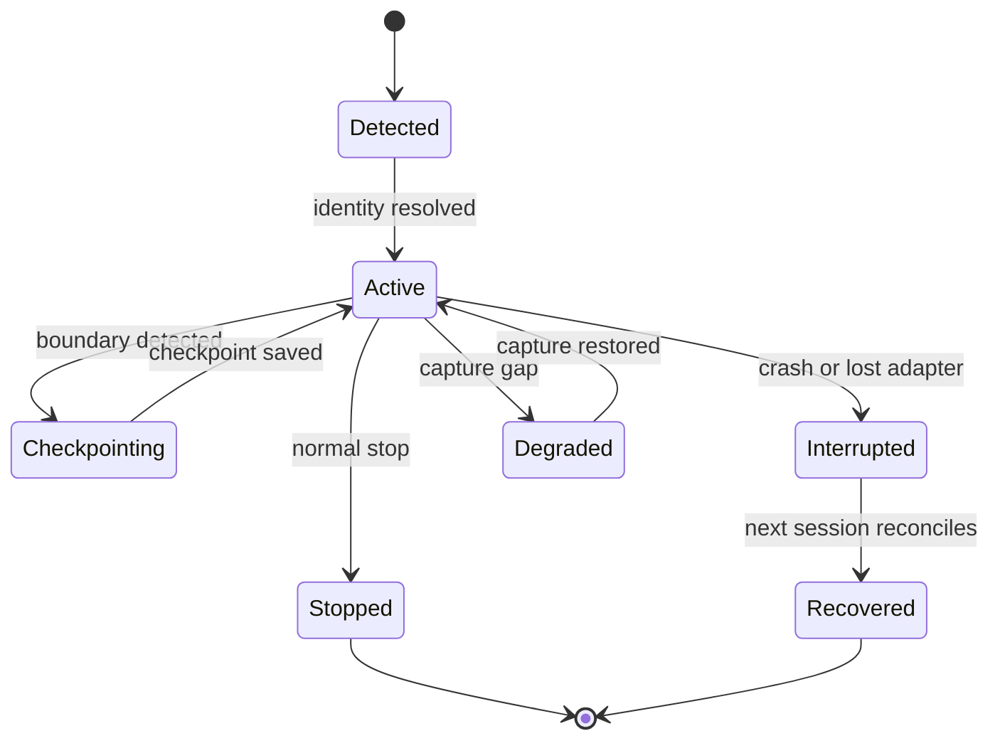
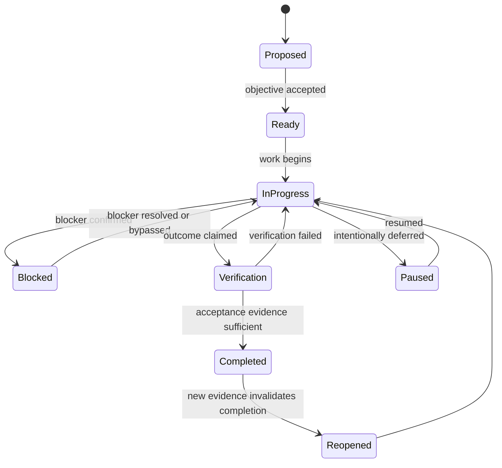
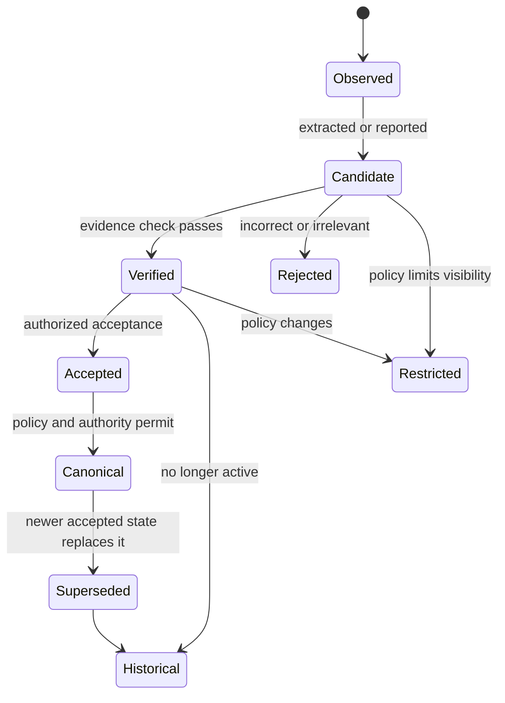
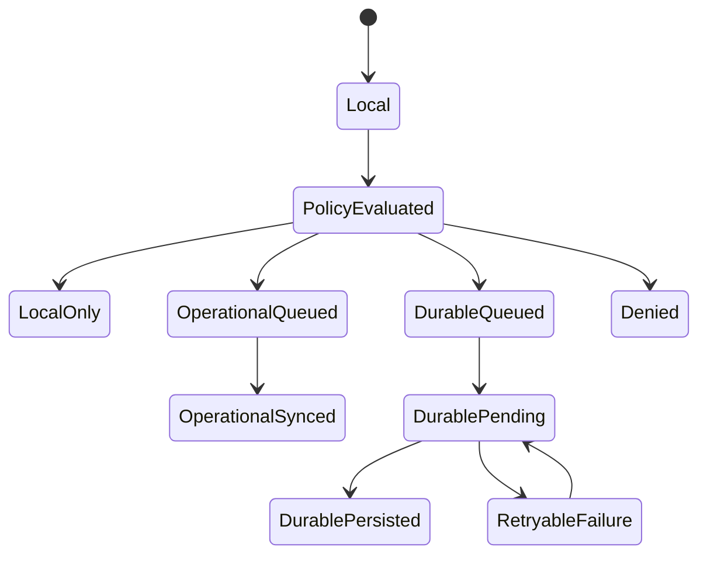
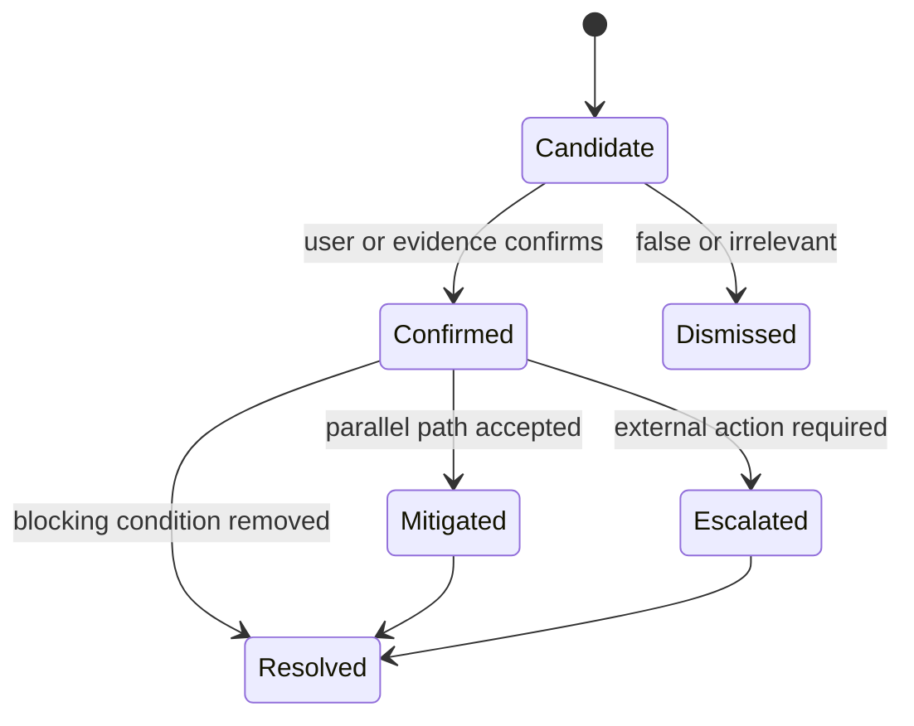

# Shoo Session, Memory and Coordination Lifecycles

- Version: 0.2
- Status: Accepted — Decision Gate 2
- Owner role: Principal UX Architect / Distributed Systems Architect
- Dependencies: Scenario Workflows; Service Blueprint
- Assumptions: State models define product behavior, not persistence technology
- Unresolved questions: Numeric completion thresholds remain an evaluation decision
- Last decision: Sponsor approved the orthogonal lifecycle model and safe durable defaults
- Next action: Use lifecycle states to constrain Phase 3 scope; defer contracts to Phase 5

## Session lifecycle

Rules:

- `Stopped` describes a session, not a completed work unit.
- `Degraded` is user-visible and carries a completeness estimate/capability statement.
- A session can have multiple checkpoints.
- An interrupted session may later gain a recovery summary, but its missing evidence remains explicit.

## Work-unit lifecycle

Rules:

- Agent inactivity cannot move a work unit to `Completed`.
- Completion must be supported by the work unit's outcome and evidence, not a generic session summary.
- A work unit may span OpenCode, Codex, and multiple developers.
- Branch-specific progress does not automatically update canonical project completion.

## Memory lifecycle

Rules:

- Not every verified fact needs canonical status.
- Canonical status applies within a scope such as project, branch, module, or work unit.
- Supersession preserves lineage and affected citations.
- Restriction is about access, not truth value.
- Deletion/forget and durable retention are separate operations with explicit outcomes.

## Sync lifecycle

Rules:

- Operational sync and durable persistence are separate acknowledgements.
- Durable failure cannot roll back a valid local checkpoint.
- A policy version is attached to each routing decision.
- Team sharing is an additional visibility transition, not equivalent to durable persistence.

## Blocker lifecycle

Blocker status does not automatically determine work-unit status for other tasks. Impact must be evaluated per dependency.

## Decision matrix — work-unit identity

| Option | User effort | Cross-agent continuity | External dependency | Ambiguity | Recommendation |
|---|---:|---:|---:|---:|---|
| Require issue-tracker item | High | Strong | High | Low | Too restrictive for MVP |
| Infer task entirely from conversation | Low | Medium | None | High | Too unreliable |
| Shoo work unit with optional issue/branch links | Medium-low | Strong | Low | Medium-low | Recommended |

Recommended workflow: Shoo proposes a work unit from recent evidence; the user confirms only when confidence is insufficient. Existing issue IDs and branches are links, not mandatory identity.

## Lifecycle invariants

- Every derived state points to evidence and the rule/policy version that produced it.
- Duplicate events cannot produce duplicate durable memory.
- Out-of-order events may revise derived state but cannot erase history.
- Correction creates lineage; it does not silently mutate prior evidence.
- An unavailable dependency produces a degraded state, not fabricated success.
