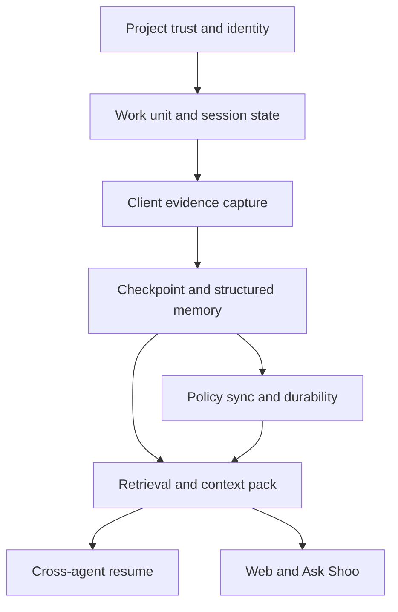

# Shoo Feature Dependency Map

- Version: 0.2
- Status: Accepted — Decision Gate 3
- Owner role: Staff Software Architect / Principal Product Manager
- Dependencies: Feature Inventory; MVP Release Boundaries
- Assumptions: This is a product dependency graph, not a final component architecture
- Unresolved questions: Which predecessor capabilities satisfy dependencies without migration rewrite
- Last decision: Sponsor approved the product dependency graph and shared truth-path constraint
- Next action: Use the graph to order Phase 4 requirements without selecting technology

## Critical product dependency path

No downstream feature may bypass provenance, authority, visibility, supersession, or policy routing.

## Detailed dependency table

| Consumer capability | Hard dependencies | Soft dependencies | Failure if missing |
|---|---|---|---|
| Work-unit match | Project identity, session signal | Branch/issue link | Context attaches to wrong work |
| Semantic checkpoint | Normalized evidence, work unit, session state | Test/file signals | Summary lacks scope or completion meaning |
| Structured memory | Checkpoint/evidence, narrow taxonomy | Extraction model | Transcript becomes primary memory |
| Canonical/accepted state | Provenance, authority rule, user/role identity | Conflict detection | Agent claim becomes truth |
| Operational sync | Local policy decision, idempotency identity | Network | Duplicate/lost progress |
| MemWal persistence | Durable eligibility, serialized memory, outbox | Bulk batching | Coding blocks or durable status lies |
| Retrieval | Project/scope filters, memory status | Semantic index | Cross-project/stale retrieval |
| Context pack | Retrieval, ranking, token budget, citations | Resume recommendation | Agent receives noise or unsupported claims |
| Codex resume | Context pack, work-unit selection, connectivity | Hook capture | Manual recap remains necessary |
| Project overview | Operational state, current memory projection | Durable status | Dashboard conflicts with agent context |
| Correction | Source trail, permission, supersession | Web source drawer | Wrong memory continues propagating |
| Ask Shoo | Same retrieval/ranking/citation path | Query classifier | Second inconsistent truth system |
| SCRR measurement | Resume event, useful-action/re-explanation signal | User feedback | MVP value cannot be evaluated |

## Dependency constraints

### Constraint 1 — Retrieval cannot precede authority semantics

Vector/semantic retrieval may be prototyped early, but it cannot become the product retrieval path until scope, authority, supersession, and citation rules exist.

### Constraint 2 — Durable persistence cannot own realtime truth

MemWal/Walrus receives policy-selected durable records. Active session and retry state require an operational source. A pending Walrus job cannot make the checkpoint disappear.

### Constraint 3 — Web cannot create a parallel projection

Project overview, decisions, unfinished work, context packs, and Ask Shoo must consume the same canonical/current-state resolver.

### Constraint 4 — Client adapters cannot define domain semantics

OpenCode `session.idle` and Codex `Stop` are normalized evidence. Shoo workflow rules decide whether a checkpoint or work-state transition is appropriate.

### Constraint 5 — Team readiness cannot pull team scope into MVP

Organization/team/member/scope identifiers are dependency-enabling constraints, not permission to build team dashboards or coordination engines.

## Parallelizable work after contracts are known

The following can progress in parallel only after their shared product contracts are approved in later phases:

- OpenCode and Codex adapter implementations against one normalized evidence contract.
- Shoo Web views against one current-state projection.
- MemWal adapter and operational outbox against one durable-memory envelope.
- Retrieval ranking and evaluation fixtures against one memory/authority model.

This does not authorize implementation before PRD and AICD gates.
