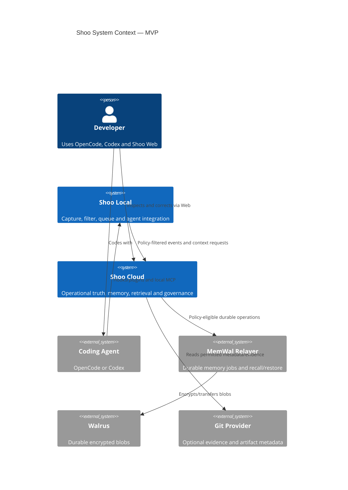
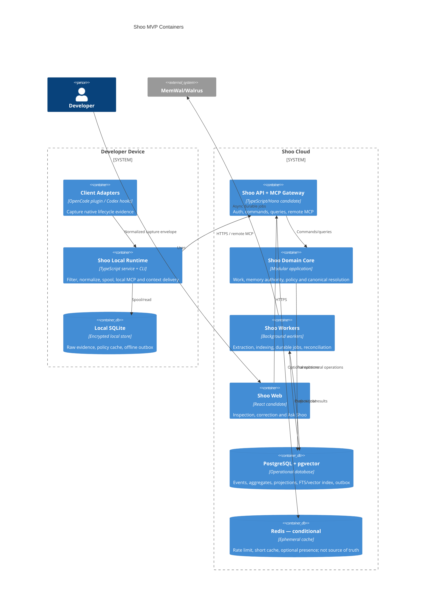

# Shoo System Context and Container Architecture

- Version: 0.1
- Status: Accepted — Decision Gate 5
- Owner role: Staff Software Architect / Distributed Systems Architect
- Dependencies: Accepted PRDs; AICD Plan; Service Blueprint
- Assumptions: MVP supports hosted control plane plus local runtime; one primary cloud region is sufficient for private alpha
- Unresolved questions: Managed versus manual MemWal beta trust mode; identity provider; hosting provider/region
- Last decision: Recommend a modular cloud core with workers, not microservices, plus a separately packaged local runtime
- Next action: Validate boundaries against contracts, threat model, and deployment failure sequences in Phase 5B

## Context diagram

## Recommended architecture style

### Decision matrix

Scores: 1 poor, 5 strong. Operational complexity and cost are scored as favorable when higher.

| Option | User value | MVP speed | Reliability | Scale | Operability | Cost | Reversibility | Weighted view |
|---|---:|---:|---:|---:|---:|---:|---:|---|
| Extend current combined container | 2 | 4 | 2 | 2 | 2 | 4 | 2 | Fast but preserves predecessor coupling |
| Modular cloud core + workers + local runtime | 5 | 4 | 4 | 4 | 4 | 4 | 5 | **Recommended** |
| Microservices from day one | 4 | 1 | 3 | 5 | 1 | 1 | 2 | Premature for unvalidated load/team scope |

Decision: build a modular monolith for synchronous Shoo Cloud APIs and domain transactions, separate horizontally scalable background workers, a separately deployed Web app, and a local runtime. Modules communicate in-process through explicit ports now and may split later through the event/outbox boundary.

## Container diagram

## Container responsibilities and boundaries

| Container | Owns | Does not own | Primary failure behavior |
|---|---|---|---|
| Client adapters | Native event capture, capability manifest, source identity | Work/memory truth | Mark unsupported/degraded; never fabricate events |
| Local runtime | Pre-egress filtering, local spool, policy preview, local MCP, retry | Canonical project truth | Continue locally, queue eligible envelopes, expose lag |
| API/MCP Gateway | Authentication, authorization, validation, idempotency boundary | Extraction or durable polling | Reject invalid scope; return accepted handles for async work |
| Domain Core | Work/session/memory/policy transitions and resolver commands | Provider-specific schemas | Optimistic conflict response with current version |
| Workers | Extraction, indexing, pack building, durable orchestration, reconciliation | Direct authority promotion | Retry idempotently; dead-letter visibly |
| Web | Inspect, correct, ask, policy/deletion status | Independent current-state projection | Display partial/stale/degraded states from API |
| PostgreSQL | Operational source of truth, event ledger, projections, outbox | Durable decentralized ownership | Transaction rollback; point-in-time recovery |
| Redis | Optional ephemeral acceleration | Any irreplaceable state | Cache miss/fallback to PostgreSQL |
| MemWal/Walrus | Policy-selected durable records and restore source | Realtime session/work state or automatic canon | Async pending/failed/reconciled states |

## Technology baseline

| Concern | Recommendation | Reason | Reversal condition |
|---|---|---|---|
| Cloud application | TypeScript on Node.js 22, modular domain packages | Existing competence/code reuse and shared schemas | Measured runtime constraint or provider incompatibility |
| HTTP framework | Hono candidate, validate in spike | Existing Sensei experience and portable runtime | Auth/streaming/observability integration fails fitness tests |
| Operational DB | PostgreSQL | Transactions, RLS option, JSONB, FTS, mature operations | Proven workload requires separated specialized store |
| Semantic index | pgvector initially | One consistency/operations plane for MVP | Corpus/latency/recall benchmark crosses approved threshold |
| Local store | SQLite with application encryption/OS key storage | Offline transactional spool and portable packaging | Client packaging demonstrates a safer simpler store |
| Async jobs | PostgreSQL outbox + worker leases first | Avoid early queue infrastructure while retaining correctness | Throughput/latency or isolation requires dedicated broker |
| Redis | Optional, not MVP truth dependency | Useful for rate limit/cache, safely removable | Omit until a measured need appears |
| Web | React migration candidate | Existing predecessor UI reuse | UX architecture selects another compatible surface |

## Component decomposition inside Shoo Domain Core

| Component | Responsibility | Inputs | Outputs | Persistence | Scaling/security boundary |
|---|---|---|---|---|---|
| Identity & Scope | Tenant/project/member/client identity and grants | Auth claims, project link | Scope context, authorization decision | PostgreSQL | Security boundary; fail closed |
| Work & Session | Work units, session lifecycle, checkpoints | Normalized events, commands | State transitions, domain events | Aggregate tables + event ledger | Partition by project/work unit |
| Capture Policy | Classify local/operational/durable/shared eligibility | Evidence metadata, policy version | Route decision and explanation | Versioned policy records | Execute locally and revalidate cloud-side |
| Memory Authority | Candidate, verification, canonical, supersession, conflict | Extracted candidate, corrections | Versioned memory state | PostgreSQL | Strong mutation authorization |
| Canonical Resolver | Compute current truth per scope/time | Memories, decisions, permissions | Current-state projection | Rebuildable projections | Shared by all surfaces |
| Retrieval | Filter, retrieve, rank, budget, cite | Query/context request | Manifested result set | PostgreSQL/pgvector | Permission checked before and after ranking |
| Durable Coordinator | Schedule and reconcile MemWal operations | Eligible immutable payload | Durable handle/status | Outbox + durable mapping | External trust boundary |

## Scale model

- Partition logical work by `organization_id + project_id`; order-sensitive operations add `work_unit_id` or `session_id`.
- API is stateless except explicit operation handles.
- Workers scale by job type and partition lease.
- Read projections and retrieval replicas may scale independently after measurement.
- Do not shard PostgreSQL or split modules before load, tenant-isolation, or team-scope evidence demands it.
