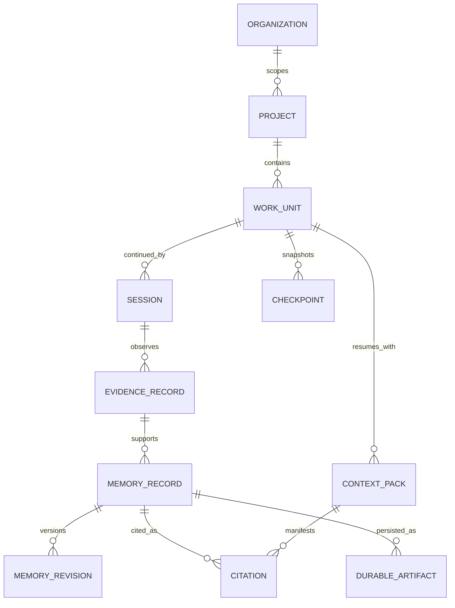
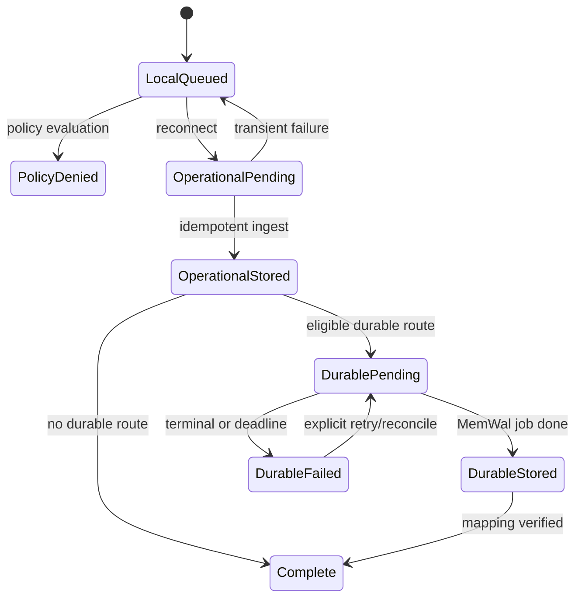

# Shoo Domain, Data and Consistency Architecture

- Version: 0.1
- Status: Accepted — Decision Gate 5
- Owner role: Data Architect / Distributed Systems Architect
- Dependencies: Accepted PRDs; System Context & Container Architecture; Lifecycle artifacts
- Assumptions: PostgreSQL is the MVP operational source of truth; event volume fits a single primary region
- Unresolved questions: RLS versus service-enforced tenancy defense-in-depth; retention periods; model for encrypted local evidence references
- Last decision: Use transactional aggregates plus an append-only event ledger and outbox, not full event sourcing
- Next action: Specify physical schemas, command/event contracts, indexes, retention jobs, and migration rules in Phase 5B

## Domain boundaries

| Bounded context | Aggregates / roots | Owns | Never infers automatically |
|---|---|---|---|
| Identity & Access | Organization, Workspace, Team, Member, ProjectGrant, AgentIdentity | Tenant scope, roles, visibility grants | Authority from visibility |
| Project Continuity | Project, WorkUnit, Session, Checkpoint | Current work lifecycle and continuity identity | Work completion from session stop |
| Evidence & Memory | EvidenceRecord, MemoryRecord, Decision, Conflict | Provenance, verification, supersession, authority | Canon from recency or agent confidence |
| Sync & Durability | SyncPolicy, SyncAttempt, DurableArtifact | Routing policy, operational/durable state | Canon from durable success |
| Intelligence | RetrievalRequest, ContextPack, Answer, Citation | Query intent, ranking manifest, grounded output | Fact from model fluency |
| Coordination | Blocker, Dependency, Handoff | Future references/invariants only | Team-wide impact without graph evidence |

## Domain relationship model



## Identity and key strategy

- Use sortable UUIDv7-compatible identifiers generated at the ingress owner of the record.
- Every cloud record carries `organization_id` and `project_id`; records with narrower scope add `team_id`, `developer_id`, `agent_id`, `session_id`, and `work_unit_id` as applicable.
- Source-native IDs are attributes under a namespaced `source_ref`, never Shoo primary keys.
- Local envelopes carry a stable `device_id`, `adapter_instance_id`, `source_event_id`, and `idempotency_key`.
- Branch is not an identity. Store normalized repository/worktree/commit references separately.

## Operational data classes

| Class | Examples | Store | Retention posture |
|---|---|---|---|
| Local restricted evidence | Raw prompts, transcript, source, verbose tool output, secrets-filter report | Encrypted local SQLite/files | Short/default configurable; not uploaded |
| Operational authoritative | Work/session state, memory revisions, policy, permissions, conflicts | PostgreSQL | Contract/legal schedule; auditable |
| Rebuildable projections | Current state, recent activity, retrieval features, status summaries | PostgreSQL materialized tables | Rebuild from ledger/aggregates |
| Ephemeral | Rate limits, short cache, leases, notifications | PostgreSQL lease or Redis | TTL; loss tolerated |
| Durable portable | Accepted checkpoint/decision/handoff summary, integrity metadata | MemWal/Walrus + operational mapping | Walrus epoch/retention truth exposed |

## Event envelope

```json
{
  "event_id": "uuidv7",
  "event_type": "session.checkpointed",
  "schema_version": 1,
  "organization_id": "org_id",
  "project_id": "project_id",
  "work_unit_id": "work_id",
  "session_id": "session_id",
  "actor": { "developer_id": "dev_id", "agent_id": "agent_id" },
  "source": {
    "client": "opencode",
    "adapter_version": "x.y.z",
    "source_event_id": "native_id",
    "capability_manifest_version": 1
  },
  "occurred_at": "RFC3339",
  "received_at": "RFC3339",
  "policy_version": 3,
  "idempotency_key": "sha256-scoped-key",
  "correlation_id": "uuidv7",
  "causation_id": "event_or_command_id",
  "payload": {},
  "integrity": { "payload_hash": "sha256" }
}
```

The envelope is a contract shape, not final production JSON. Phase 5B defines field types and privacy classification.

## Event taxonomy

### Accepted MVP events

- `project.linked`, `project.link_reconciled`;
- `work_unit.proposed`, `work_unit.selected`, `work_unit.reassigned`, `work_unit.state_changed`;
- `session.started`, `session.capture_degraded`, `session.checkpointed`, `session.completed`, `session.failed`;
- `evidence.observed`, `memory.candidate_extracted`, `memory.verified`, `memory.corrected`, `memory.superseded`;
- `decision.proposed`, `decision.accepted`, `decision.superseded`;
- `conflict.detected`, `conflict.resolved`;
- `context.requested`, `context.built`, `context.consumed`;
- `sync.route_decided`, `durable.requested`, `durable.persisted`, `durable.failed`, `durable.reconciled`.

Future blocker/dependency/handoff events remain schema-reserved, not emitted by MVP services except migration fixtures.

## Consistency model

| Operation | Model | Mechanism | User-visible conflict behavior |
|---|---|---|---|
| Authentication, grant/revocation | Strong within primary | Transaction + version | Deny on uncertainty; invalidate cache |
| Work-unit/session state command | Strong per aggregate | Optimistic concurrency/version | Return current version and targeted resolution |
| Canonical accept/supersede/correct | Strong per memory/decision lineage | Transaction, authorization, unique active constraint | Preserve both evidence branches; require resolution |
| Evidence ingestion | At-least-once | Idempotency key + unique source constraint | Duplicate acknowledged as same result |
| Extraction and projections | Eventual | Outbox worker + replay | Show pending/partial freshness |
| Retrieval index | Eventual bounded by index watermark | Transactional feature write or worker watermark | Expose freshness; authoritative filters query current tables |
| MemWal/Walrus persistence | Eventual external | Durable outbox + job state machine | Pending/failed does not block work or imply loss of operational state |
| Analytics/evaluation | Eventual | Privacy-safe event pipeline | Never used for authority decisions |

## Ordering and duplicate handling

- Global total ordering is rejected.
- For each source adapter, `source_sequence` is used when the client provides it; otherwise order by source time with received time and causal evidence retained.
- Work/session transitions serialize by aggregate version, not wall-clock alone.
- Out-of-order evidence is accepted, then projections are recomputed if it changes derived state.
- Duplicate uniqueness key: `organization_id + project_id + adapter_instance_id + source_event_id`; deterministic hash fallback only when no native ID exists.
- Same payload from different sources is not a duplicate; it may be corroborating evidence.

## Retry and dead-letter policy

| Failure class | Retry | Terminal handling |
|---|---|---|
| Validation/permission/policy deny | No | Rejected with safe reason and audit event |
| Optimistic conflict | Client-directed | Return version/current state; never blind retry mutation |
| Network/rate limit/transient provider | Exponential backoff with jitter and deadline | Visible failed/pending status; manual retry |
| Incompatible schema/SDK | No automatic write | Quarantine and compatibility alert |
| Poison extraction/model response | Bounded retry by model/prompt version | Dead-letter candidate; raw eligible evidence remains intact |
| MemWal accepted job timeout | Poll/reconcile, never resubmit blindly | Query job/mapping before idempotent replacement |

## Offline and sync recovery



## Transactional outbox

Every domain transaction that requires asynchronous processing writes:

1. aggregate mutation;
2. immutable event ledger row;
3. outbox job with deterministic operation key;

in one PostgreSQL transaction. Worker completion writes result and watermark transactionally. This prevents dual-write gaps between operational truth and background work.

## Deletion and correction semantics

- Correction creates a new revision and supersession edge; it does not rewrite evidence.
- Operational deletion follows authorization and retention policy, leaving minimum audit tombstone where lawful.
- Local deletion, operational deletion, vector/index removal, MemWal recall removal, and Walrus blob expiry are separate states.
- User-facing deletion status must never claim physical durable deletion unless verified by the underlying system.

## Rejected designs

- Full event sourcing for every query path: too much MVP complexity.
- Last-write-wins canonical memory: violates authority semantics.
- Walrus as operational database: latency/consistency mismatch.
- Redis as queue/source of truth before measured need.
- One flat vector namespace per organization.
