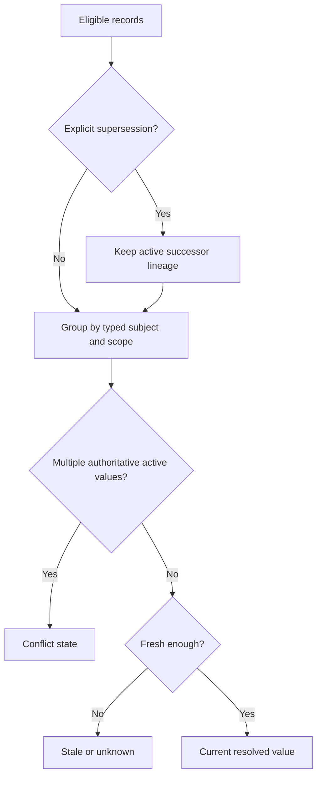
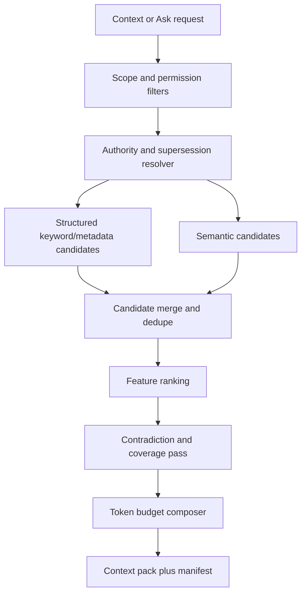

# Shoo Memory, Retrieval and Canonical Resolution Architecture

- Version: 0.1
- Status: Accepted — Decision Gate 5
- Owner role: AI Systems Architect / Data Architect
- Dependencies: Shoo Memory PRD; Shoo Intelligence PRD; Domain/Data Architecture
- Assumptions: Narrow structured extraction is more reliable than general transcript summarization; PostgreSQL plus pgvector can serve MVP scale
- Unresolved questions: Initial rank weights, extraction provider/model, token budgets, and memory-type verification policies
- Last decision: Use a deterministic authority resolver before hybrid ranking; semantic similarity can never override scope or supersession
- Next action: Define schemas, ranking feature contract, evaluation corpus, and sequence diagrams in Phase 5B

## Memory layers

| Layer | Meaning | Mutability | Primary store |
|---|---|---|---|
| Raw evidence | Observed client/tool/file/test/session signal | Immutable; retention-controlled | Local by default; selected metadata operational |
| Candidate memory | Structured claim extracted from evidence | Versioned | PostgreSQL |
| Working memory | Current work/session projection for continuation | Rebuildable and rapidly changing | PostgreSQL/local cache |
| Accepted memory | Human/rule-verified scoped knowledge | New revisions, no destructive overwrite | PostgreSQL |
| Canonical memory | Current authorized project truth for a defined subject/scope | Explicit accept/supersede | PostgreSQL resolver projection |
| Historical memory | Superseded/expired context retained for lineage | Immutable lineage | PostgreSQL; durable if policy-selected |
| Durable artifact | Portable encrypted representation and manifest | Immutable blob/version | MemWal/Walrus |
| Context pack | Token-bounded retrieval result with manifest | Immutable generated snapshot, cacheable | Operational short retention |

## MVP structured memory taxonomy

- fact;
- decision;
- task/work state;
- progress/checkpoint;
- code change reference;
- test result;
- bug;
- blocker;
- risk;
- convention/learning;
- question;
- conflict/resolution.

Handoff and dependency types may exist as reserved schema but do not activate team workflows.

## Authority model

Independent fields:

- `claim_status`: observed, inferred, claimed;
- `verification_status`: unverified, corroborated, verified, disputed;
- `authority_status`: personal, session, branch, team, canonical, historical;
- `visibility_scope`: private, project, team, organization;
- `durability_status`: local, operational, durable_pending, durable, durable_failed;
- `freshness_status`: current, stale, expired, unknown;
- `lineage_status`: active, superseded, deprecated, conflicted.

No field transition implies another field transition.

## Canonical resolver

Resolution key is a typed subject, not free text:

`organization + project + subject_type + subject_key + branch/scope + effective_time`.

Resolver order:

1. enforce tenant/project/visibility permission;
2. select matching typed subject and applicable branch/scope;
3. remove revoked/deleted/ineligible records;
4. follow explicit supersession lineage;
5. prefer accepted authority over agent claim regardless of recency;
6. detect concurrent active authoritative values as conflict;
7. calculate freshness from source/change evidence;
8. emit current, conflicted, stale, or unknown result with reasons.

## Hybrid retrieval pipeline

Mandatory pre-rank filters:

- tenant/project/visibility;
- active permission at request time;
- relevant work unit/branch/module/file scope;
- non-superseded current truth for current-state intents;
- allowed memory types and source policy.

Candidate sources:

- exact structured fields and typed relationships;
- PostgreSQL full-text search;
- pgvector semantic similarity;
- graph-adjacent work/decision/file relationships;
- recent verified checkpoint/current-state projection.

## Ranking contract

Ranking is a versioned function over normalized features:

`score = f(intent, scope_match, work_match, branch_match, dependency_proximity, authority, verification, freshness, semantic_similarity, lexical_match, source_quality, contradiction_penalty)`.

Hard rules override score:

- unauthorized = excluded;
- superseded current-state fact = excluded but may appear under history intent;
- unresolved conflict = represented as conflict, never silently pick one;
- missing citation = cannot be emitted as fact;
- token budget cannot remove the objective, next action, or conflict notice required for safe continuation.

Initial weights remain configuration, not architecture truth, and must be benchmarked in Phase 9.

## Context pack contract

Required sections:

1. identity: project, work unit, branch/worktree, requesting client;
2. objective and current work state;
3. verified progress and affected artifacts;
4. current decisions and constraints;
5. tests/results;
6. unresolved blockers/conflicts/uncertainty;
7. recommended next action, labeled suggestion;
8. source citations and freshness;
9. completeness/degraded/durability indicators;
10. retrieval manifest and resolver/ranker versions.

Pack identity is immutable and content-addressed. A later correction creates a new pack and invalidates prior cache entries.

## Ask Shoo behavior

- Classify intent: current state, history, rationale, occurrence search, resume, or unsupported/general.
- Retrieve through the same pipeline as context packs.
- Compose output into `facts`, `inferences`, and `suggestions` with per-claim citations.
- For insufficient evidence, answer “unknown from available project evidence” and state missing evidence.
- Never use MemWal's general `ask` or `analyze` endpoints as Shoo canonical truth; Shoo owns extraction, authority, and citation semantics.

## Contradiction handling

| Situation | Behavior |
|---|---|
| Agent claim contradicts verified fact | Keep claim as disputed evidence; verified fact remains current |
| Two accepted decisions overlap | Create conflict; require authorized resolution |
| New source contradicts stale canonical record | Mark stale/conflict and propose review; do not auto-supersede high-impact decision |
| Branch-specific decision differs from project canon | Preserve branch scope; do not leak into unrelated branch context |
| User correction | New revision, explicit supersession, cache invalidation, durable successor if eligible |

## Retrieval observability

Log only safe metadata:

- request intent and scope IDs;
- filter/candidate counts;
- feature/ranker version;
- selected record IDs and score components;
- token allocation;
- citation coverage;
- index watermark/freshness;
- result correction/usage signals.

Do not log retrieved plaintext, prompts, source, or secrets by default.

## Scaling and fallback

- Begin with PostgreSQL FTS + pgvector to preserve filters and reduce operational divergence.
- On vector/index outage, return structured current-state results with degraded semantic coverage.
- On model/extraction outage, retain evidence and checkpoint metadata; process later.
- Split to dedicated search only when benchmarked corpus/latency/recall requires it, preserving the retrieval port and manifest.
