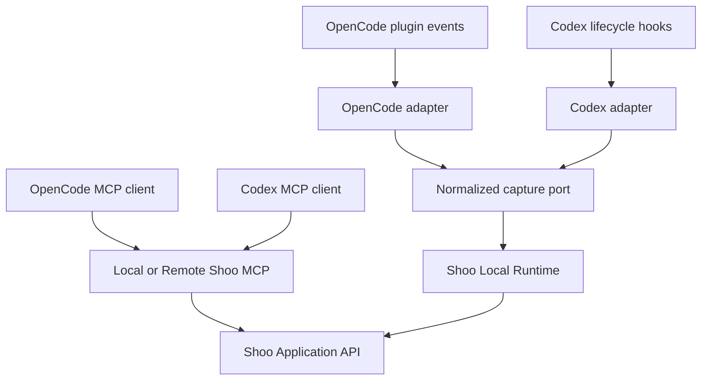

# Shoo MCP and Client Integration Architecture

- Version: 0.1
- Status: Accepted — Decision Gate 5
- Owner role: MCP Protocol Architect / Developer Experience Architect
- Dependencies: Shoo Platform PRD; Core PRD; System Architecture; current MCP/OpenCode/Codex evidence
- Assumptions: MCP 2025-11-25 is the stable MVP compatibility baseline; OpenCode plugin and Codex hooks remain available
- Unresolved questions: Remote OAuth provider; exact hook event coverage; stdio versus remote default by client; compatibility policy for future MCP revisions
- Last decision: MCP is a narrow agent access plane; native adapters own automatic capture and normalize into the same Shoo application commands
- Next action: Define JSON Schemas, errors, scopes, resources, prompts, transport tests, and client capability matrix in Phase 5B

## Integration principles

- MCP does not define Shoo session identity; explicit Shoo IDs are passed in arguments/results.
- Automatic capture comes from client-native plugins/hooks, not model-dependent tool calls.
- Model-controlled tools are minimal, intent-based, idempotent where possible, and permission-scoped.
- Read-only addressable context uses resources when clients support them reliably.
- Prompts are optional user-invoked workflow templates, never hidden automation.
- Local and remote MCP expose the same semantic contracts; transports differ in auth and availability.
- Client capability differences are declared, not hidden behind false parity.

## Client architecture



## MVP MCP surface decision

The original broad tool list is intentionally reduced. Tools that only duplicate read resources or future team workflow are deferred.

### MVP tools

| Tool | Purpose | Mutation | Async handle | Notes |
|---|---|---:|---:|---|
| `shoo.start_session` | Resolve project/work unit and register supported session | Yes | No | Safe to retry with idempotency key |
| `shoo.checkpoint_session` | Explicit semantic checkpoint/correction boundary | Yes | Maybe | Automatic checkpoints primarily adapter-driven |
| `shoo.complete_session` | Record session outcome without implying work completion | Yes | Yes | Returns extraction/durability status handles |
| `shoo.resume_session` | Resolve work and return a context-pack handle/content | Mixed | Maybe | Records resume attempt separately |
| `shoo.get_context` | Retrieve token-bounded scoped context | No | No | Same retrieval path as Web/Ask |
| `shoo.recall` | Search project memory with explicit current/history intent | No | No | Structured filters plus citations |
| `shoo.remember` | Propose an explicit structured memory/evidence note | Yes | Yes | Does not auto-canonicalize |
| `shoo.supersede_memory` | Authorized correction/supersession | Yes | No | Requires expected version and reason |
| `shoo.mark_canonical` | High-impact authority action | Yes | No | Disabled unless identity has scope |

### MVP resources

| URI template | Content | Cache behavior |
|---|---|---|
| `shoo://projects/{project_id}/pulse` | Current project/work state summary | Private, short TTL, invalidated on state changes |
| `shoo://projects/{project_id}/work/{work_unit_id}/context` | Current context pack representation | Private, versioned by pack ID |
| `shoo://projects/{project_id}/decisions/current` | Current accepted decisions | Private, versioned resolver watermark |
| `shoo://projects/{project_id}/activity/recent` | Recent normalized activity | Private, cursor-based |
| `shoo://memories/{memory_id}` | One authorized memory with provenance/lineage | Private, versioned |
| `shoo://sources/{source_id}` | Permitted evidence metadata or excerpt | Private; may return unavailable-local status |

### Optional prompts

- `shoo.resume_work`: user-invoked continuation workflow;
- `shoo.create_checkpoint`: user-invoked checkpoint review;
- `shoo.explain_decision`: cited rationale workflow.

Prompts cannot grant permission or bypass tool confirmation.

### Deferred MCP tools

- `shoo.claim_task`;
- `shoo.report_blocker` as team coordination behavior;
- `shoo.create_dependency`;
- `shoo.request_handoff`;
- `shoo.get_available_work`;
- all Team Pace, critical path, team activity and blocked-work tools.

Local blocker evidence may be captured through checkpoint structure without activating coordination services.

## Common request context

Every stateful tool takes a common envelope conceptually containing:

```json
{
  "project_id": "project_id",
  "work_unit_id": "work_id_or_null",
  "session_id": "session_id_or_null",
  "client": { "name": "codex", "version": "...", "adapter_version": "..." },
  "idempotency_key": "client-generated-key",
  "expected_version": 7,
  "request_scope": { "branch": "...", "worktree": "..." }
}
```

Server derives actor/tenant authorization from the credential, never from caller-supplied IDs alone.

## Result envelope

Every result includes:

- `request_id` and relevant Shoo IDs;
- `status`: complete, accepted, pending, partial, degraded, conflict, denied, failed;
- `freshness` and `completeness` where relevant;
- `operation_handle` for asynchronous work;
- `citations` for factual content;
- `warnings` and actionable recovery;
- `schema_version` and server capability version.

## Error model

| Code family | Meaning | Retry behavior |
|---|---|---|
| `INVALID_ARGUMENT` | Schema/scope invalid | Fix request |
| `UNAUTHENTICATED` / `PERMISSION_DENIED` | Identity or grant failure | Re-auth/request access; no blind retry |
| `VERSION_CONFLICT` | Optimistic concurrency mismatch | Fetch current state and resolve |
| `CAPABILITY_UNAVAILABLE` | Client/hook/resource not supported | Use declared fallback |
| `POLICY_DENIED` | Sync/content route disallowed | Change authorized policy or keep local |
| `DEPENDENCY_DEGRADED` | Cloud/model/MemWal unavailable | Continue local/operational path where possible |
| `ACCEPTED` | Async job scheduled | Poll operation; do not resubmit |

## Authentication boundary

- Local stdio MCP inherits a local user session and retrieves secrets from OS-protected storage/environment; credentials are never emitted to the model.
- Remote Streamable HTTP uses OAuth-compatible authorization and project scopes; bearer credentials stay in the client transport layer.
- Local capture adapters authenticate to Shoo Local through installation-scoped IPC/token and cannot mint cloud tenant authority.
- Step-up confirmation is required for canonicalization, broad sharing, export, and deletion.

## Capability matrix

| Capability | OpenCode MVP | Codex MVP | Fallback |
|---|---|---|---|
| Automatic lifecycle capture | Rich plugin events | Lifecycle hooks, coverage validated | Explicit checkpoint/complete tool |
| MCP context/recall | Yes | Yes | CLI/Web context preview |
| Cross-agent resume | Source client | Primary target client | Copy bounded context pack |
| File/tool event evidence | Capability-dependent | Capability-dependent | Git/test metadata or user confirmation |
| Pre-compaction checkpoint | If event exists | If hook exists | Periodic/explicit semantic checkpoint |

## Protocol version posture

- Advertise and test an explicit supported range; do not claim “latest MCP.”
- Pin the MCP SDK and run conformance/compatibility CI.
- A new MCP revision requires an adapter compatibility ADR and backward-compatibility tests.
- Shoo operation handles remain explicit even if a protocol transport offers sessions, preserving semantic portability.

## Observability and privacy

Trace transport/tool/resource method, latency, result status, safe scope IDs, schema version, and correlation ID. Do not log tool arguments/results containing project content by default.
