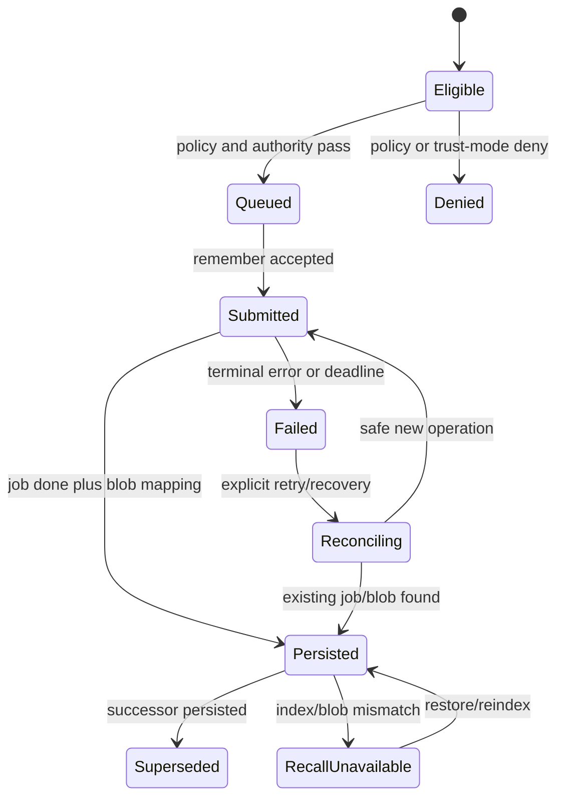

# Shoo MemWal/Walrus Integration and Trust Model

- Version: 0.2
- Status: Accepted — Decision Gate 5
- Owner role: Walrus Integration Architect / Security Architect / Data Architect
- Dependencies: Shoo Platform PRD; Memory PRD; current MemWal upstream evidence; Data Architecture
- Assumptions: MemWal/Walrus remains mandatory; beta APIs and operational limits may change; MemWal Manual supports the required client platforms
- Unresolved questions: Manual-flow compatibility, headless signer policy, Walrus retention cost, package ownership, and multi-device recovery
- Last decision: MemWal Manual is Shoo's default durable path; account, delegate and namespace belong to the user
- Next action: Validate wallet/headless flows and finalize adapter, retention, recovery, and rotation contracts

## Role of Walrus in Shoo

Walrus provides meaningful value only for policy-selected records requiring portability, durable retention, owner/delegate control, integrity verification, or recovery independent of Shoo's operational database. It is not used for presence, live locks, active sessions, notifications, transient checkpoints, or realtime coordination.

## Durable eligibility

### Default eligible

- accepted semantic checkpoint summaries;
- accepted/canonical decisions and superseding decision revisions;
- verified session outcome summaries;
- user-approved reusable conventions/learnings;
- canonical snapshot manifests;
- future authorized handoff packs;
- integrity manifests and evidence references that do not expose restricted source.

### Default ineligible

- raw prompts/transcripts;
- raw source code and full diffs;
- secrets, credentials, private keys;
- verbose tool output/logs;
- unverified agent claims;
- active presence, locks, notifications;
- telemetry and individual usage metrics;
- data with deletion requirements incompatible with known durable retention.

## Trust mode decision matrix

| Mode | Relayer sees plaintext | DX | Shoo control | Operational burden | Sensitive payload fit | Recommendation |
|---|---:|---:|---:|---:|---:|---|
| Managed `MemWal` | Yes | 5 | 2 | 5 | 1–2 | R0 technical proof with non-sensitive summaries only |
| `MemWalManual` local crypto/embedding | No plaintext payload at relayer for core flow; vectors/metadata still exposed | 2 | 4 | 2 | 4 | Preferred beta candidate if maturity passes spike |
| Self-hosted relayer | Inside Shoo trust boundary | 3 | 4 | 2 | 4 | Enterprise/controlled beta candidate |
| TEE pattern | Reduced operator trust | 2 | 4 | 1 | 4 | Future after ecosystem maturity |
| Shoo envelope encryption over managed flow | Relayer cannot embed/search opaque payload without a separate Shoo index | 2 | 5 | 2 | 5 storage, 0 native recall | Use only for archive artifacts with separate retrieval metadata |

Accepted staged posture:

1. **R0:** MemWal Manual on testnet with synthetic/non-sensitive summaries, compatibility and recovery proof.
2. **R1/R2:** MemWal Manual remains default for real user data; managed mode is disabled unless explicitly introduced as a separate policy-reviewed mode.
3. **Never:** upload the user's primary wallet private key to Shoo or claim E2E encryption for managed mode.
4. **Fallback:** when Manual is unavailable, queue the eligible durable record locally/operationally; do not silently switch to managed mode.

## Namespace strategy

MemWal recall is scoped by `owner + namespace`. Shoo must avoid one flat namespace.

Proposed namespace grammar:

`shoo:v1:{environment}:{organization_id}:{project_id}:{visibility_scope}:{record_class}`

Rules:

- do not include human-readable private names;
- namespace version is explicit;
- branch/work-unit filtering lives in signed/encrypted record metadata and Shoo index, not unlimited namespaces;
- organization/project deletion or export enumerates namespace registry from Shoo Operational;
- package ID, owner, account ID, and namespace together define durable locator scope.

## Durable record envelope

```json
{
  "format": "shoo.durable-memory",
  "schema_version": 1,
  "record_id": "memory_revision_id",
  "record_type": "accepted_checkpoint",
  "project_scope": "opaque_project_id",
  "authority": "accepted",
  "effective_at": "RFC3339",
  "supersedes": ["prior_record_id"],
  "content": {},
  "citations": [{ "source_id": "opaque_id", "source_hash": "sha256" }],
  "policy_version": 3,
  "resolver_version": 2,
  "integrity": { "canonical_hash": "sha256" }
}
```

This is a logical envelope. Final serialization, encryption and size constraints are Phase 5B work.

## Persistence state machine



`Persisted` means Shoo has verified the MemWal terminal result and recorded blob/job identity. It does not mean canonical, current, shared, or physically undeletable forever.

## Adapter contract

The Shoo durable port exposes product semantics, not raw SDK methods:

- `submitDurableRecord(record, operationKey, trustMode)`;
- `getDurableOperation(handle)`;
- `recallDurableReferences(scope, query, filters)`;
- `restoreNamespace(scope, cursor/limit)`;
- `verifyDurableRecord(locator, expectedHash)`;
- `reconcileDurableOperation(operationKey)`;
- `describeRetentionAndDeletion(locator)`.

The adapter translates to `remember`, polling, recall, restore, compatibility checks, or manual flow. It must pin SDK versions and reject incompatible relayer versions before writes.

## Idempotency and reconciliation

- Compute a Shoo `durable_operation_key` from immutable record revision + namespace + trust mode + schema version.
- Store operation row before calling MemWal.
- After `remember` acceptance, persist `job_id` immediately.
- Timeout never triggers blind resubmission; first poll/reconcile by job/operation mapping.
- Persist `blob_id`, owner, namespace, account/package identity, SDK/relayer versions, payload hash and completion time.
- Periodic reconciler compares operational mappings, MemWal recall/index results and known Walrus locator state without making recall the current-truth resolver.

## Restore semantics

Restore rebuilds missing MemWal index entries; it does not rebuild Shoo authority, supersession or permissions by itself. Shoo restoration requires:

1. restore/index durable blobs;
2. validate Shoo envelope/schema/integrity;
3. import into a quarantined recovery projection;
4. reconcile against operational audit/permissions;
5. promote only records allowed by current policy.

## Versioning and rollback

- Durable blobs are immutable revisions.
- Correction/supersession writes a successor and updates Shoo Operational current truth.
- Rollback means activating a new revision referencing the prior valid content, not mutating a blob.
- Schema readers support an explicit compatibility window and migration registry.
- MemWal SDK/relayer upgrades use canary namespace, dual-read comparison, then controlled cutover; no `latest` dependency.

## Failure fallback

| Failure | Shoo behavior |
|---|---|
| MemWal unavailable | Preserve operational record; queue durable job; show pending/degraded |
| Walrus upload fails | Retry through job policy; coding continues |
| Recall index missing | Use Shoo Operational retrieval; schedule restore/reconcile |
| Blob expired/unavailable | Mark durable evidence unavailable; never erase operational lineage silently |
| SDK/relayer incompatible | Block new durable writes, preserve queue, alert operator |
| Trust mode cannot accept classification | Deny durable route and keep permitted operational/local copy |

## Cost model inputs

Phase 5C must estimate:

- durable records per eligible session;
- average serialized/encrypted size;
- Walrus storage epochs/retention;
- remember/analyze request points and account quotas;
- embedding/model cost for managed versus Shoo retrieval;
- restore and re-embedding cost;
- self-hosted relayer, PostgreSQL/pgvector, Redis, SEAL sidecar and operations cost.

Cost optimization order: reduce durable record count/noise, compact schema, batch within supported limits, extend retention only for valuable classes, then consider infrastructure optimization.

## Security controls

- Delegate key generated per environment/device/service role and stored in OS secret manager/KMS, never application config or prompts.
- Rotation and revocation are auditable; loss of one delegate must not grant owner authority.
- Namespace and account mapping are authorization data, not secret substitutes.
- Payload classification and redaction happen before the adapter.
- Verify upstream trust model and version on every release; marketing copy uses only validated claims.
