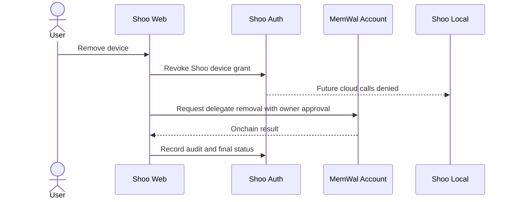

# Shoo Identity, Permission and User-Owned Memory

- Version: 0.1
- Status: Accepted — Decision Gate 5
- Owner role: Security Architect / Data Architect / Principal UX Architect
- Dependencies: Accepted PRD; Domain Architecture; MemWal/Walrus Trust Model
- Assumptions: MemWal account and wallet ownership remain with the user; Commercial SaaS identity is separate from wallet identity
- Unresolved questions: Organization invitation model; enterprise SSO; exact MemWal package ownership; multi-owner/team memory account model
- Last decision: User approved user-owned memory and application authorization plus PostgreSQL FORCE RLS
- Next action: Trace permission decisions into schemas, APIs, MCP, sequences, and threat controls

## Identity layers

Shoo must not collapse four different identities:

| Identity | Purpose | Authority source |
|---|---|---|
| Shoo user | Commercial SaaS login, billing and project membership | Shoo identity provider |
| Developer/device | Local capture source and device revocation | Shoo user authorization |
| Agent/session | Evidence provenance and capability | Client adapter registration |
| MemWal owner/delegate | Durable memory ownership and relayer authentication | Sui/MemWal onchain account |

A wallet signature proves control of a wallet; it does not automatically grant access to a Shoo organization or project. Shoo membership does not grant control of the user's MemWal account.

## User-owned durable identity

Accepted ownership model:

- User owns the Sui wallet and MemWal account.
- Shoo stores the public wallet address, MemWal account ID, package/app ID, namespace registry and delegate public identifiers.
- Shoo Cloud never receives the owner private key or delegate private key.
- Each device receives its own delegate key; delegates are revocable independently.
- Namespace is project-scoped under the user's account.
- Shoo provides exportable namespace/mapping manifests so the user can recover outside Shoo.

## Permission model

### MVP roles

| Role | Scope | Allowed |
|---|---|---|
| Project Owner | Project | Link/delete project, manage policy, export, canonicalize, connect MemWal identity |
| Developer | Project | Capture own evidence, create checkpoints, query permitted memory, propose/correct scoped records |
| Device Adapter | One user/device/project set | Ingest evidence and request context within grants; no membership/policy/canonical authority |
| Background Worker | Job scope | Process one authorized tenant job; no interactive access |
| Support Operator | Operational metadata only | Diagnose safe metadata with explicit audited elevation; no project content by default |

Solo MVP assigns Project Owner and Developer to the same Shoo user but keeps permissions separate for future team expansion.

## Authorization decision inputs

Every request evaluates:

- authenticated Shoo subject;
- organization/project membership and role;
- action and target resource;
- visibility scope;
- current record authority state;
- device/agent grant and revocation;
- sync policy and durable trust mode;
- expected aggregate version;
- optional step-up confirmation.

## Balanced PostgreSQL isolation

Recommended design:

1. API validates action through a central authorization service.
2. A database transaction sets immutable local context such as organization, project and actor IDs.
3. Tenant tables enable and `FORCE ROW LEVEL SECURITY`.
4. Runtime connection role is not table owner, superuser or `BYPASSRLS`.
5. `USING` policies constrain reads/updates/deletes; `WITH CHECK` constrains inserts/updates.
6. Worker claims one tenant-scoped job and sets the same context before reading payload data.
7. Migration/maintenance role is isolated from request-serving credentials and fully audited.

Why this is the balance point:

- user sees no database permission UX;
- application provides understandable product errors;
- RLS contains accidental missing filters;
- one connection pool remains practical;
- Shoo avoids schema/database-per-tenant cost before enterprise demand.

Rejected:

- app filtering alone;
- trusting caller-supplied `organization_id`;
- one superuser runtime role;
- one database user per Shoo user;
- wallet address as the only SaaS identity.

## Step-up actions

Require recent reauthentication or wallet confirmation for:

- registering/removing MemWal delegates;
- changing owner/account/package mapping;
- marking project-level canonical decisions;
- expanding durable/shared policy;
- exporting all project memory;
- deleting project/account mappings;
- enabling headless wallet mode.

## Revocation behavior

Partial failure is explicit: Shoo grant may be revoked before onchain delegate removal completes. UI shows both states and retries the onchain step without restoring Shoo access.

## Authorization tests required

- cross-organization/project read/write denial;
- forged caller scope ignored;
- runtime role cannot bypass RLS;
- table-owner/migration role never serves API traffic;
- background job cannot switch tenant mid-transaction;
- permission revocation invalidates context-pack caches;
- visibility does not imply authority;
- canonical status does not imply organization-wide visibility;
- device/delegate revocation partial failure remains safe.
