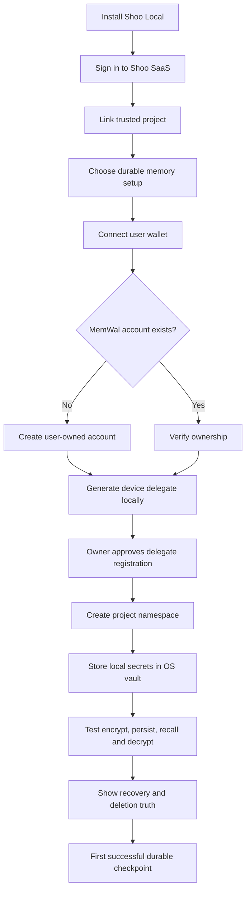

# Shoo Local Security, Key Management and MemWal Onboarding

- Version: 0.2
- Status: Accepted — Decision Gate 5; implementation validation pending
- Owner role: Security Architect / Developer Experience Architect / Principal UX Architect
- Dependencies: User-Owned Memory Model; MemWal Manual; Shoo Local architecture
- Assumptions: Target desktop systems provide OS credential storage in normal interactive environments; wallet signer can authorize Manual recall
- Unresolved questions: Linux headless fallback; browser/CLI wallet handoff; SEAL session-key cache lifetime; supported wallet matrix; SQLCipher defense-in-depth result
- Last decision: ART-72 selects application-level AEAD for sensitive SQLite payloads and keeps SQLCipher behind a cross-platform/licensing spike
- Next action: Define security contracts and validate Windows-first, then Linux/macOS recovery flows

## Key hierarchy

| Secret/key | Purpose | Default location | Never stored in |
|---|---|---|---|
| User owner wallet key | Own MemWal account and recovery authority | User wallet only | Shoo Cloud, Shoo config, SQLite, logs |
| Delegate private key | Authenticate one Shoo device to MemWal relayer | OS credential vault | SQLite, project repo, environment file, telemetry |
| SQLite data-encryption key | Encrypt local Shoo evidence/spool | OS credential vault | SQLite file, cloud, repo |
| SEAL session key | Batch Manual decryptions | Process memory with short TTL | Disk, logs, cloud |
| Headless Shoo Memory Wallet key | Optional noninteractive Manual signing | OS credential vault, explicit opt-in | SQLite, repo, Shoo Cloud |
| Embedding provider token | Local embedding call | OS credential vault | SQLite, prompts, logs |

## Cross-platform secure storage

| Platform | Default vault | Behavior |
|---|---|---|
| Windows | DPAPI CurrentUser / Windows Credential protection | Secret available only to the signed-in OS user; no machine-wide default |
| macOS | Keychain Services | App-scoped item; optionally require user presence for high-impact key access |
| Linux desktop | Secret Service-compatible keyring | Store per-user item in login session |
| Linux without secure vault | Passphrase-derived unlock or deny persistent restricted capture | Never silently fall back to plaintext/env file |

The local SQLite store holds eligible evidence/spool and minimal operational metadata. Sensitive payload fields use application-level authenticated encryption with a random per-record nonce and associated scope/schema data; the key is generated randomly and stored separately in the OS vault. Paths, excerpts and detailed errors are encrypted. Plaintext is limited to opaque IDs, ordering/scheduling state, retry counters and coarse timestamps required for offline operation.

SQLCipher may add full database-file encryption only after Windows/macOS/Linux ABI, prebuilt packaging, WAL/crash recovery, key rotation and redistribution licensing pass SPIKE-01. No unofficial fork becomes a trust dependency without review.

## Default interactive mode

- User keeps the owner key in their wallet.
- Shoo Local generates a device delegate key and stores it in the OS vault.
- Manual writes encrypt locally and do not require exporting the owner wallet key.
- Manual recall requests wallet authorization when required by SEAL.
- One authorized SEAL session key may be reused in memory for a short bounded session to avoid repeated prompts.
- Lock, logout, sleep or configured inactivity clears the session key.

Proposed initial cache policy for testing: 30 minutes or current Shoo work session, whichever ends first. This is an evaluation default, not yet canonical.

## Optional headless mode

Headless mode is for unattended agent continuation and must not be the onboarding default.

Requirements:

- create/import a dedicated **Shoo Memory Wallet**, not the user's primary funds wallet;
- display exactly what the wallet can decrypt/sign;
- require recovery acknowledgement and encrypted backup readiness;
- store the key only in OS vault;
- create one revocable delegate per device;
- allow one-click device disable plus onchain delegate removal;
- optionally require local OS unlock at daemon start;
- never expose the key through MCP, model prompts or environment diagnostics.

## Onboarding flow

## User-facing setup guide

Shoo should guide, not ask users to copy raw secrets manually:

1. **Connect wallet:** explain that the wallet owns portable memory; Shoo never receives its private key.
2. **Create/verify MemWal account:** show network, owner address, account ID and package/app ID.
3. **Add this device:** generate delegate locally, show masked fingerprint, request wallet approval.
4. **Name the namespace:** default from opaque Shoo project ID; allow a friendly label stored only in Shoo UI.
5. **Choose unlock mode:** interactive wallet default or advanced headless mode.
6. **Recovery check:** explain that lost Manual decryption keys can make memories unrecoverable; verify wallet backup readiness without asking for seed phrase.
7. **Round-trip test:** store a synthetic encrypted record, recall/decrypt it, then remove it from the test index if supported.
8. **Finish:** show effective owner, device delegate, namespace, storage duration and sync policy.

Never request the user's seed phrase or primary wallet private key.

## Failure and recovery UX

| Failure | UX response |
|---|---|
| Wallet unavailable | Continue local/operational mode; durable recall/write pending |
| Delegate revoked | Mark device disconnected; start re-registration |
| OS vault locked | Ask for OS unlock; do not delete or recreate identity automatically |
| SQLite key missing | Quarantine encrypted local store; offer recovery/resync, never overwrite silently |
| Owner key lost | Explain encrypted durable memory may be unrecoverable; do not claim Shoo can reset it |
| Namespace mismatch | Stop writes, display owner/account/package/namespace comparison |
| Manual SDK incompatible | Preserve queue, block durable operations, offer update/rollback |

## Backup posture

- Durable accepted records are recoverable through the user's MemWal/Walrus identity, subject to key and blob retention.
- Raw local evidence is not automatically backed up to cloud.
- Optional local export is encrypted with a user-provided recovery secret or public recovery key.
- Shoo must test restoration before claiming recovery readiness.
