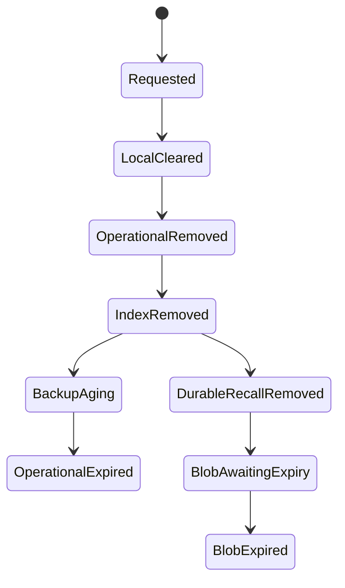

# Shoo Deployment, Scale Triggers and Retention

- Version: 0.2
- Status: Accepted — Decision Gate 5; empirical validation pending
- Owner role: Platform Engineer / Data Architect / Security Architect
- Dependencies: System Architecture; Data Architecture; Commercial SaaS decision; User-Owned Memory Model
- Assumptions: Initial cohort is concentrated in Vietnam/SEA; paid managed infrastructure is acceptable for beta; PostgreSQL portability is preserved
- Unresolved questions: Provider quotes; legal retention by customer type; Walrus epoch cost; enterprise region demand
- Last decision: ART-42–46 define the SLO, environment, cost, migration and executable fitness baseline
- Next action: Execute deployment, restore, latency, cost and Walrus tests in R0–R2

## Deployment recommendation

### R0–R2

Use paid, same-region services in Singapore:

- Shoo API/MCP Gateway;
- Shoo Workers;
- managed PostgreSQL with pgvector;
- Shoo Web/CDN;
- secrets/credentials service;
- observability export without project content.

Recommended delivery choice: Render Singapore for R0–R2 because it supports co-located services and managed PostgreSQL with pgvector, while matching current project operational familiarity. Do not use free instances for user data or availability validation.

This is not permanent platform lock-in. Containers, migrations, SQL schemas, backup format and object identifiers remain provider-neutral.

### R3 review

Remain on the initial provider unless one or more conditions require AWS `ap-southeast-1` or another target:

- multi-AZ/database availability requirement not met;
- private networking/KMS/audit/compliance capability gap;
- contractual data-residency requirement;
- provider outage/error budget breach;
- cost at measured workload is materially worse;
- enterprise customer requires dedicated deployment.

Do not migrate to AWS merely for perceived prestige.

## Region model

- Initial operational region: Singapore.
- Keep API, workers and PostgreSQL in the same region.
- Backups stay in the same jurisdiction by default; a cross-region copy requires explicit policy.
- Walrus durable blobs are not represented as Singapore-resident data. UI/legal text must distinguish Shoo Operational region from decentralized durable storage.
- Multi-region active-active is rejected for MVP.

## Vector-store split triggers

Keep PostgreSQL + pgvector until at least one hard capability gap or two sustained performance triggers occur after tuning.

### Hard triggers

- required hybrid/filtered retrieval cannot be implemented correctly;
- index recovery or tenant isolation cannot meet approved requirements;
- vector extension/version is unsupported by the selected managed PostgreSQL platform.

### Provisional sustained triggers

- active vector rows exceed **3 million per region**;
- p95 filtered vector candidate query exceeds **250 ms** under approved benchmark after index/query tuning;
- vector workload consumes over **30% of database CPU** or causes transactional SLO breaches;
- vector index exceeds **40% of operational database storage**;
- full index rebuild/recovery exceeds **4 hours**.

Numeric triggers are engineering hypotheses for Phase 5C, not product success thresholds.

## Dedicated broker split triggers

Keep PostgreSQL outbox until one of these persists outside a provider outage:

- p95 normal-priority job age exceeds **30 seconds** or p99 exceeds **5 minutes** for three consecutive days;
- worker polling/leases consume over **15% of PostgreSQL CPU** or cause lock/transaction contention;
- sustained workload exceeds **50 jobs/second** and cannot be absorbed by batching/partitioning;
- independent replay retention beyond seven days or cross-region replication is required;
- one job class needs isolation that PostgreSQL leases cannot provide safely.

Before splitting, try batching, job-type partitions, partial indexes, worker concurrency and backpressure.

## Initial retention recommendation

| Data class | Default | User control / deletion truth |
|---|---|---|
| Raw local prompts/transcripts/tool output | 7 days; configurable 0–30 | Clear now; never cloud-synced by default |
| Local offline envelopes | Until cloud acknowledgement + 7 days | Clear after verified sync; preserve failed items visibly |
| Cloud raw source/transcript | Not stored by default | Explicit policy exception only |
| Normalized operational events | 90 days | Project deletion workflow; minimum tombstone if required |
| Current accepted/canonical memory | Until user deletion or project retention policy | Supersession preserves lineage until policy expiry |
| Superseded memory/audit lineage | 365 days initial hypothesis | Shorter/longer by plan/legal need; not current truth |
| Security/audit records | 365 days | Content-minimized; restricted operator access |
| Detailed operational telemetry | 30 days | No prompts/source; aggregate non-personal metrics may last longer |
| PostgreSQL backups/PITR | 30 days | Deleted data ages out; restore process must reapply tombstones |
| Context-pack cache | 24 hours maximum or invalidation event | Immediate invalidation on permission/correction/supersession |
| Walrus durable blob | Explicit configured epoch count; beta starts at 50 epochs pending cost review | Recall/index removal is distinct from physical blob expiry |

These periods are product recommendations, not legal conclusions. Legal review may shorten or extend them by market/customer type.

## Deletion state model

Shoo displays each layer independently. “Deleted from Shoo” must not be presented as “physically erased from Walrus” until expiry is verifiable.

## Phase 5C fitness tests

- Vietnam-to-Singapore API/context latency;
- PostgreSQL failover, restore and RLS behavior;
- 3M-vector synthetic benchmark and filtered retrieval quality;
- outbox saturation, worker crash, poison job and replay;
- 30-day backup/PITR and tombstone reapplication;
- provider export and restore into a clean PostgreSQL target;
- Walrus 50-epoch cost/expiry visibility;
- region outage degraded-mode behavior.
