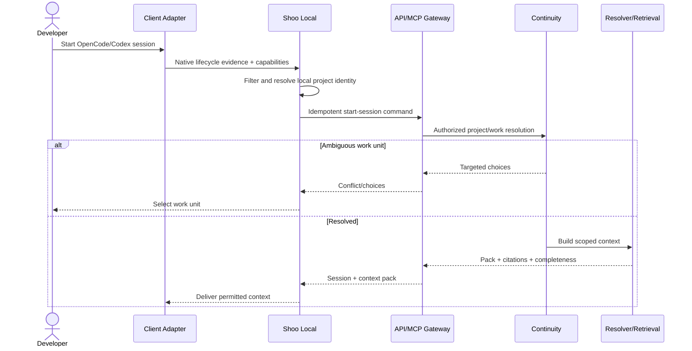
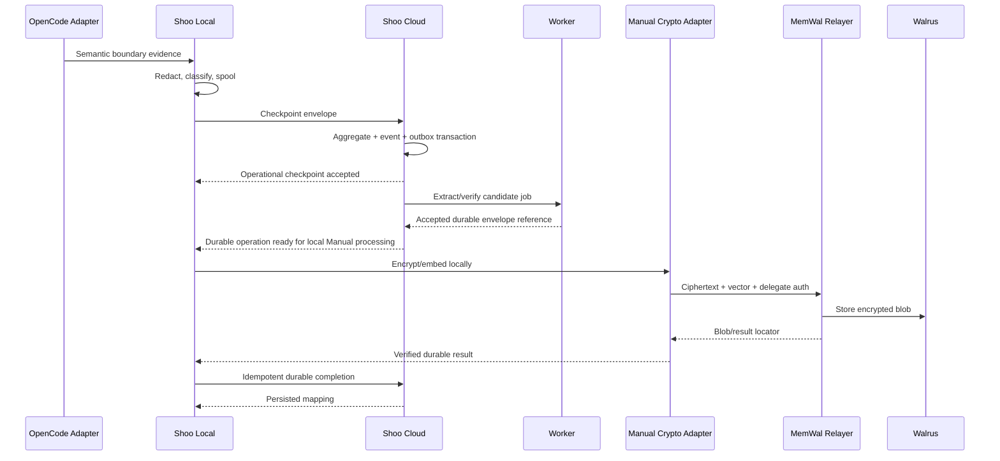
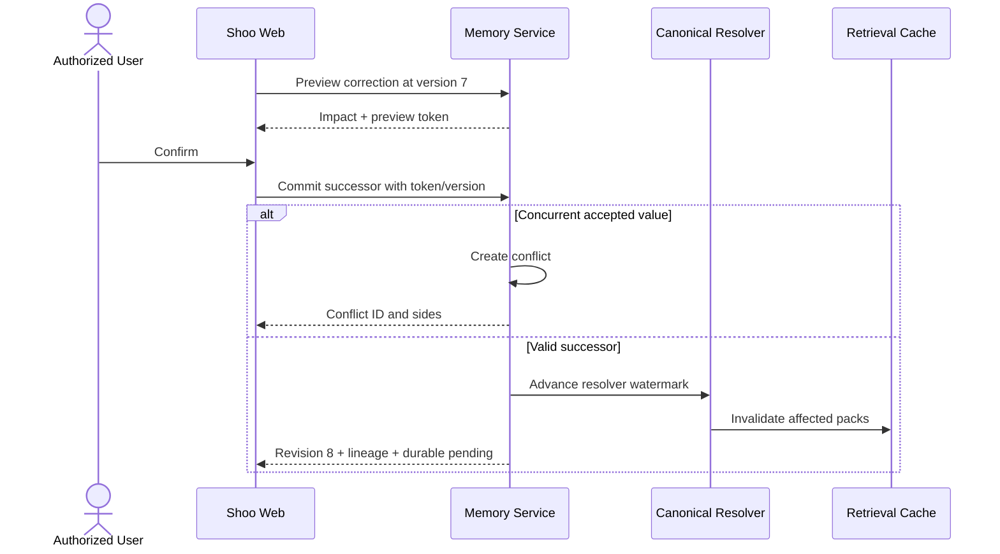

# Shoo Component Specifications and Sequence Designs

- Version: 0.1
- Status: Accepted — Decision Gate 5
- Owner role: Staff Software Architect / Distributed Systems Architect / Platform Engineer
- Dependencies: System Architecture; Data Schemas; HTTP/MCP Contracts; MemWal Manual design
- Assumptions: Modular cloud core and transactional outbox remain proposed architecture; Shoo Local can run a background process per user
- Unresolved questions: IPC mechanism; extraction/model provider; worker runtime topology; wallet browser handoff implementation
- Last decision: Every asynchronous boundary uses explicit operation/idempotency handles and visible degraded states
- Next action: Validate sequences through architecture tests and prototype spikes in Phase 5C

## Component contract template

Every component declares responsibility, inputs, outputs, dependencies, failure modes, scaling, security, persistence and observability. Provider SDK objects do not cross component boundaries.

## Shoo Local components

### Client Adapter Manager

- Responsibility: load OpenCode/Codex adapters, negotiate capabilities, normalize native events.
- Inputs: client events/hooks, repository/worktree identity.
- Outputs: normalized local capture envelopes.
- Dependencies: adapter packages, policy cache.
- Failure modes: unsupported client version, missing event, duplicate/out-of-order event.
- Scaling: one lightweight adapter instance per active client session.
- Security: treat native content as untrusted; no cloud credentials exposed to client/model.
- Persistence: capability manifests and source cursor in encrypted local store.
- Observability: adapter version, event counts, missing capability and degradation reason only.

### Local Policy and Redaction Engine

- Responsibility: classify evidence before egress and explain routing.
- Inputs: capture envelope, path/content classification, signed policy version.
- Outputs: local-only, operational, durable-eligible, shared-denied route decisions.
- Dependencies: policy cache, secret/path detectors.
- Failure modes: stale/invalid policy, detector error, ambiguous classification.
- Scaling: CPU-bound local pipeline; bounded queue/backpressure.
- Security: fail closed to local-only when policy cannot be evaluated.
- Persistence: policy decision and safe fingerprint; raw input retained only by local policy.
- Observability: classification code/policy version, not content.

### Local Spool and Sync Agent

- Responsibility: encrypted evidence store, offline outbox, idempotent cloud sync and Manual durable queue.
- Inputs: routed envelopes and cloud acknowledgements.
- Outputs: batched ingest requests, retry state, visible lag.
- Dependencies: encrypted SQLite, OS vault, HTTPS client.
- Failure modes: disk full, vault locked, schema mismatch, network outage.
- Scaling: bounded local retention and batch size; one writer lease.
- Security: database key outside SQLite; restrictive file permissions.
- Persistence: SQLite transaction per capture/outbox mutation.
- Observability: queue age/count, disk class, retry code; never raw payload.

### Manual Crypto Adapter

- Responsibility: local embedding, SEAL encrypt/decrypt, MemWal Manual compatibility and Walrus download.
- Inputs: accepted durable envelope or recall query, user binding/namespace, wallet/session authorization.
- Outputs: ciphertext/vector submission or decrypted authorized memory.
- Dependencies: MemWal Manual, embedding provider, wallet signer, OS vault.
- Failure modes: wallet denied, key unavailable, SDK mismatch, embedding failure, SEAL/Walrus error.
- Scaling: bounded concurrent embedding/crypto; batch recall under one in-memory session key.
- Security: plaintext and private keys never cross to Shoo Cloud/relayer; zero/clear sensitive buffers where runtime permits.
- Persistence: operation metadata only; session key memory-only.
- Observability: stage status/latency and safe locators.

## Cloud components

### API and MCP Gateway

- Responsibility: transport auth, schema validation, rate limits, idempotency and request routing.
- Inputs: HTTPS/MCP requests.
- Outputs: application commands/queries and stable envelopes.
- Dependencies: identity provider, authorization, operation registry.
- Failure modes: invalid token/schema, insufficient scope, overload.
- Scaling: stateless horizontal replicas.
- Security: terminate TLS, bounded parsing, no content logging, request scope derived from grants.
- Persistence: idempotency/operation records through application services.
- Observability: request/action/status/latency/correlation with safe scope IDs.

### Identity and Authorization Service

- Responsibility: Shoo membership, device grants, step-up, project authorization and DB scope context.
- Inputs: verified identity, action, target, policy/authority state.
- Outputs: allow/deny plus constrained scope context.
- Dependencies: IAM tables, RLS transaction wrapper, MemWal public binding verifier.
- Failure modes: identity provider unavailable, stale revocation, inconsistent onchain delegate state.
- Scaling: cache permitted only with revocation-aware short TTL.
- Security: fail closed; runtime role cannot bypass RLS.
- Persistence: membership/grants and immutable audit events.
- Observability: decision code and policy version, not private content.

### Continuity Service

- Responsibility: projects, repository links, work units, sessions and checkpoints.
- Inputs: normalized events and explicit commands.
- Outputs: versioned aggregate state and domain events.
- Dependencies: PostgreSQL transaction/event/outbox.
- Failure modes: ambiguous work unit, invalid transition, optimistic conflict.
- Scaling: partition logically by project/work unit.
- Security: project-scoped authorization and evidence constraints.
- Persistence: aggregate + event + outbox atomically.
- Observability: transition and conflict codes.

### Memory Authority and Conflict Service

- Responsibility: candidates, revisions, verification, canonicalization, supersession and conflict lifecycle.
- Inputs: extractor candidates, corrections, authority commands.
- Outputs: current lineage state, conflict/resolution events, invalidation watermark.
- Dependencies: evidence store, authorization, canonical resolver.
- Failure modes: concurrent accept, invalid lineage, missing evidence, unauthorized scope.
- Scaling: serialize per typed subject/scope via optimistic version/transaction lock where necessary.
- Security: high-impact step-up and immutable audit.
- Persistence: normalized memory/conflict tables and event ledger.
- Observability: state transitions, rule versions and affected record counts.

### Canonical Resolver and Retrieval Service

- Responsibility: permission/scope/authority resolution, hybrid retrieval, ranking, contradiction pass and context composition.
- Inputs: context/Ask/recall requests.
- Outputs: immutable pack/answer plus manifest and citations.
- Dependencies: operational tables, FTS, pgvector, index watermark.
- Failure modes: stale index, model unavailable, missing citation, token overflow.
- Scaling: stateless query replicas; index/retrieval workloads monitored separately.
- Security: permission filter before/after ranking; retrieved content treated as data.
- Persistence: request/pack/manifest and short-lived cache.
- Observability: candidate counts, feature versions, watermark, tokens and citation coverage.

### Worker Runtime

- Responsibility: extraction, embeddings, projections, durable reconciliation, retention and export/deletion jobs.
- Inputs: leased outbox jobs.
- Outputs: terminal/next job state and domain results.
- Dependencies: PostgreSQL, model providers, Shoo Local operation callbacks where Manual is required.
- Failure modes: lease loss, poison payload, provider outage, partial external success.
- Scaling: worker pools by job class and tenant-safe lease.
- Security: least-privilege job-scoped access; no superuser/bypass RLS runtime.
- Persistence: result/watermark atomically with job completion.
- Observability: queue age, attempts, duration, dead-letter and dependency status.

## Sequence 1 — Trusted session start and context



## Sequence 2 — Automatic checkpoint and Manual durability



Plaintext never flows from Manual Crypto Adapter to Shoo Cloud or the relayer.

## Sequence 3 — Cross-agent resume during durable outage

```mermaid
sequenceDiagram
    actor U as Developer
    participant C as Codex
    participant L as Shoo Local
    participant G as Shoo Cloud
    participant D as MemWal/Walrus
    C->>L: Resume work request
    L->>G: Get context for work unit
    G->>G: Resolve current operational truth
    G->>D: Optional durable reference check
    D--xG: Unavailable
    G-->>L: Context pack + durable degraded warning
    L-->>C: Usable cited context
    L-->>U: Durable sync unavailable; coding can continue
```

## Sequence 4 — Correction, conflict and cache invalidation



## Sequence 5 — Offline capture reconciliation

```mermaid
sequenceDiagram
    participant A as Adapter
    participant L as Local SQLite
    participant G as Shoo Cloud
    A->>L: Capture while offline
    L->>L: Encrypt + enqueue idempotency key
    loop Until reconnect
        L-->>A: Local checkpoint/capture health
    end
    L->>G: Ordered batch with source IDs
    G->>G: Accept new, identify duplicates, quarantine incompatible
    G-->>L: Per-item results + watermark
    L->>L: Mark acked; retain failed/quarantined visibly
```

## Sequence 6 — Device and delegate revocation

```mermaid
sequenceDiagram
    actor U as User
    participant W as Shoo Web
    participant A as Shoo Authorization
    participant O as MemWal Onchain Account
    participant L as Shoo Local
    U->>W: Revoke device
    W->>A: Revoke Shoo grant immediately
    A-->>L: Future cloud access denied
    W->>O: Remove delegate with owner approval
    alt Onchain success
        O-->>W: Removed
    else Onchain pending/failure
        O-->>W: Pending
        W-->>U: Shoo access revoked; delegate cleanup pending
    end
```

## Component fitness rules

- Architecture dependency tests prevent adapters from importing domain persistence or provider SDKs outside ports.
- Every worker job has deterministic operation key and tenant scope.
- Every high-impact command produces an audit event.
- Every current-state factual output has citation coverage or explicit unknown status.
- Every provider outage has a non-blocking or clearly blocking classification.
- Every cache has a source watermark and invalidation path.
