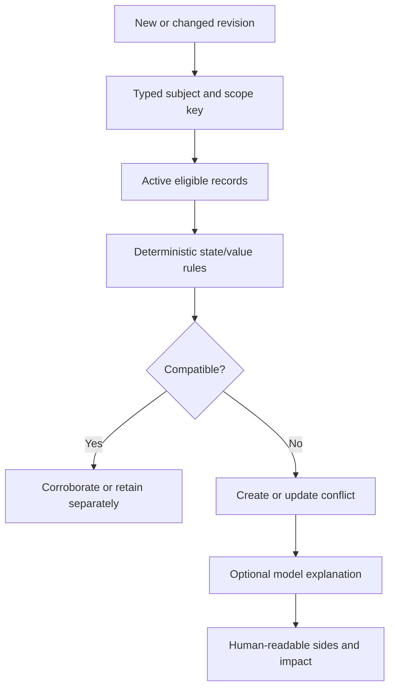

# Shoo Conflict Resolution Design

- Version: 0.1
- Status: Accepted — Decision Gate 5
- Owner role: AI Systems Architect / Data Architect / Principal UX Architect
- Dependencies: Memory Model; Canonical Resolver; Physical Schemas; Permission Model
- Assumptions: Typed subjects and explicit scopes cover high-value MVP memories; deterministic conflict rules can precede model-assisted explanation
- Unresolved questions: Per-memory-type auto-corroboration thresholds; branch merge UX; durable conflict bundle eligibility
- Last decision: Unresolved authoritative conflicts block a single canonical answer; Shoo presents sides and never lets ranking silently choose
- Next action: Build conflict fixtures and validate resolution UX/precision in Phase 5C and Phase 9

## Conflict definition

A conflict exists when two or more active records cannot simultaneously satisfy the same typed subject, effective scope and time under current authority rules.

Conflict is not synonymous with:

- duplicate evidence;
- different branch-scoped decisions;
- old superseded history;
- durable write failure;
- model uncertainty;
- two compatible partial observations.

## Conflict classes

| Class | Example | Default severity |
|---|---|---:|
| Authority conflict | Two accepted project decisions for the same subject | Critical |
| State conflict | Work unit is both completed and reopened at overlapping versions | High |
| Scope conflict | Branch-specific rule is presented as project-wide | High |
| Evidence conflict | Test pass and fail for same commit/config/time window | High |
| Identity conflict | Session attributed to wrong work unit/project | Critical |
| Temporal conflict | Newer evidence contradicts canonical record without supersession | High |
| Semantic conflict | Structured claims have incompatible values despite different wording | Medium/high |
| Visibility conflict | Resolver requires evidence the requester cannot view | Security-sensitive, not auto-resolved |
| Durable divergence | Operational record exists but Walrus mapping is missing | Operational incident, not canonical conflict |

## Detection pipeline

Models may propose subject extraction or explain incompatibility. They do not close high-impact conflicts.

## Compatibility rules

| Situation | Result |
|---|---|
| Same normalized value, different evidence | Corroboration, not conflict |
| Different values, disjoint branches/scopes | Separate scoped truths |
| Different values, non-overlapping effective times | Historical succession candidate |
| Explicit valid supersession edge | Predecessor historical, no active conflict |
| Agent claim versus verified canonical record | Claim marked disputed; canon remains current |
| Two accepted project-level values | Active conflict; no single current value |
| Visibility-hidden side | Return “conflict exists; one side restricted,” not restricted content |
| Stale canonical versus strong new evidence | Stale/conflict review; no automatic high-impact supersession |

## Conflict fingerprint

Use a deterministic fingerprint over:

`organization + project + typed_subject + normalized_scope + effective_interval + conflict_class + sorted_active_side_ids`.

This prevents duplicate conflict cards while allowing the conflict to gain or lose sides through versioned updates.

## Resolution actions

| Action | Meaning | Appropriate when |
|---|---|---|
| Select side | One side becomes current; others superseded/disputed | One accepted value is correct |
| Merge into successor | Create a new revision incorporating compatible parts | Both sides contain valid partial truth |
| Split scope | Assign sides to different branches/modules/environments | Conflict came from overbroad scope |
| Split time | Define effective intervals and historical transition | Both were true at different times |
| Downgrade authority | Keep a side as personal/session claim | It was never project canon |
| Deprecate all | No side remains current | Decision no longer applies |
| Keep unresolved | Preserve conflict and block singular current answer | Evidence/authority insufficient |

## Resolution command contract

Required inputs:

- conflict ID and expected version;
- selected action;
- side IDs and proposed resulting scope/time;
- rationale;
- evidence/decision reference;
- preview token bound to actor/action/version;
- explicit confirmation for project-canonical impact.

Outputs:

- immutable resolution ID;
- created/updated/superseded revision IDs;
- new resolver watermark;
- affected context packs/caches;
- durable successor operation status;
- remaining conflicts.

## Authorization

- Personal/session conflict: creator or project developer may resolve within own authority.
- Branch-level accepted memory: authorized branch/project maintainer.
- Project-canonical decision: Project Owner or delegated canonical authority with step-up.
- Visibility-sensitive conflict: resolver may act only on sides they can view, unless an authorized higher-scope actor handles the full conflict.
- Agents may detect/propose but cannot resolve high-impact authority conflicts autonomously.

## Concurrent resolution

1. Preview reads conflict version and active sides.
2. Commit requires same expected version and bound preview token.
3. Transaction locks/confirms conflict and side revisions.
4. If changed, return `VERSION_CONFLICT` with safe current summary.
5. Never merge concurrent resolution commands through last-write-wins.

## Resolver behavior while unresolved

For current-state intent:

- emit conflict before recommendation;
- show all permitted sides, authority, evidence, scope and freshness;
- do not select by rank, recency or confidence alone;
- suggestions must be conditional and labeled;
- context packs reserve token budget for conflict warning;
- Ask Shoo says the current state is unresolved.

For history intent, all sides and lineage may be returned subject to permissions.

## Invalidation and propagation

On conflict creation or resolution:

- advance project resolver watermark;
- invalidate packs containing affected subject/revisions;
- invalidate Ask/pulse/current-decision caches;
- mark previously delivered packs stale in manifest lookup;
- create durable successor only after authority/policy eligibility;
- do not mutate existing Walrus blobs.

## Rollback

Resolution rollback creates another explicit resolution/revision referencing the prior valid state. It never deletes the erroneous resolution from audit history. Rollback requires the same authority as the original resolution and invalidates dependent packs again.

## User correction

Correction does not automatically create conflict when the user clearly supersedes their own lower-authority claim. It creates conflict when:

- another active accepted/canonical value overlaps;
- correction broadens scope beyond the actor's authority;
- evidence remains incompatible and no explicit supersession is authorized;
- correction targets a stale version.

## Conflict quality metrics

- precision of conflict detection;
- missed authoritative contradiction rate;
- false duplicate-conflict rate;
- median time to resolution;
- context packs exposing unresolved conflict correctly;
- unauthorized side exposure rate;
- resolution rollback rate;
- stale pack served after invalidation.

No metric ranks individuals or treats conflict count as developer performance.
