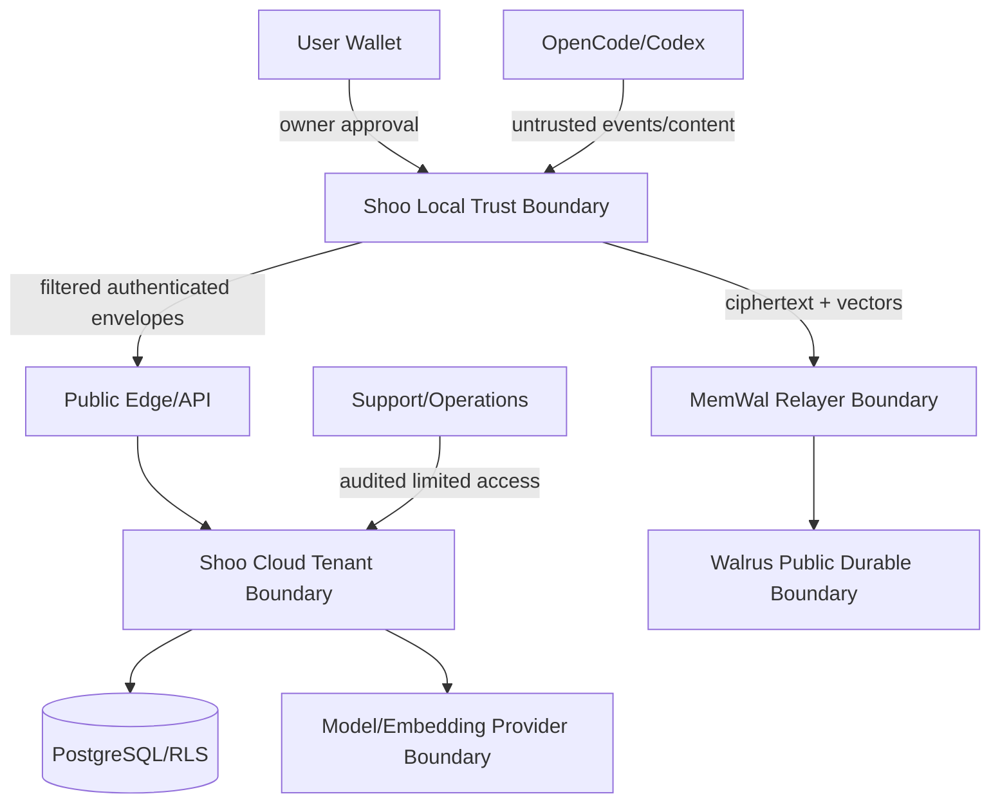

# Shoo Security and Privacy Threat Model

- Version: 0.1
- Status: Accepted — Decision Gate 5
- Owner role: Security Architect / Platform Engineer / MCP Protocol Architect
- Dependencies: System Architecture; Permission Model; Local Security; API/MCP Contracts; MemWal Manual; Data Schemas
- Assumptions: User devices may be partially compromised; repositories and retrieved memory contain untrusted content; third-party providers can fail or be malicious
- Unresolved questions: Identity provider; wallet support; embedding provider privacy terms; secure updater/signing infrastructure; incident response staffing
- Last decision: Treat local adapters, project content, model output, embeddings, relayer, Walrus and support operations as separate trust boundaries
- Next action: Convert controls into security requirements/tests and run threat review before R0/R2 gates

## Security objectives

1. Prevent cross-tenant/project disclosure or mutation.
2. Keep owner/delegate/headless wallet keys out of cloud, logs, prompts and SQLite.
3. Ensure project content cannot become instructions to Shoo infrastructure or MCP tools.
4. Preserve provenance, integrity, authority and deletion truth.
5. Continue coding safely during Shoo/provider outage.
6. Make security degradation visible and auditable.
7. Minimize durable/public exposure even when blobs are encrypted.

## Assets

| Asset | Impact if compromised |
|---|---|
| Owner wallet authority/recovery | Permanent loss or unauthorized durable access/delegate control |
| Device delegate key | Unauthorized MemWal operations for device scope |
| Headless Shoo Memory Wallet | Unauthorized decrypt/sign capability |
| Local raw evidence/source | Source, secrets, private conversation disclosure |
| Shoo tenant grants/tokens | Cross-project access or mutation |
| Canonical decisions/memory lineage | Poisoned agent context and engineering errors |
| Embeddings/vectors | Semantic information leakage/inference |
| Walrus ciphertext and locators | Durable correlation, metadata exposure, future crypto risk |
| Operational database/backups | Broad tenant/project history disclosure |
| MCP/API contracts and operation handles | Confused-deputy or replay attacks |
| Audit/security logs | Sensitive metadata and operator misuse |

## Trust boundaries

Manual embedding calls originate locally; model provider can still see embedding input unless Shoo uses a local embedding model or a provider approved by policy. Manual protects plaintext from the MemWal relayer, not automatically from the embedding provider.

## STRIDE threat register

### Spoofing

| Threat | Control | Verification |
|---|---|---|
| Forged Shoo user/device/agent identity | OIDC/OAuth validation, device registration, short token lifetime, source capability manifest | Invalid issuer/audience/signature/device tests |
| Forged MemWal delegate | Onchain delegate verification, per-device key, nonce/timestamp replay protection | Revoked/unknown delegate tests |
| Repository path impersonates another project | Repository fingerprint and explicit reconciliation | Copy/move/symlink/worktree fixtures |
| Worker impersonates another tenant | Job-scoped identity and transaction-local RLS context | Cross-tenant worker test |

### Tampering

| Threat | Control | Verification |
|---|---|---|
| Local spool modified | Encrypted/authenticated DB, payload hashes, restrictive permissions | Corruption/tamper test |
| Event replay/alteration | Idempotency key, source ID, nonce/time, event integrity hash | Duplicate/reordered/modified fixture |
| Canonical memory changed without authority | Expected version, step-up, preview token, immutable audit, RLS | Concurrent/unauthorized mutation tests |
| Walrus blob/locator mismatch | Content hash and durable mapping verification | Wrong blob/hash/namespace test |
| Supply-chain package injects capture/exfiltration | Pin/lock dependencies, provenance/SBOM/signing, update channel verification | Dependency and updater security gate |

### Repudiation

| Threat | Control | Verification |
|---|---|---|
| Actor denies canonical/deletion/delegate action | Immutable audit with actor, scope, result, request and wallet/onchain reference | Audit completeness test |
| Agent claim presented as user decision | Separate actor/source/authority states | Provenance fixture |
| Support action untraceable | Just-in-time limited access, reason/ticket, audit and expiry | Operator-access exercise |

### Information disclosure

| Threat | Control | Verification |
|---|---|---|
| Cross-tenant database read | App authorization + FORCE RLS + non-bypass runtime role | Tenant matrix and direct SQL tests |
| Secrets/raw source leave device | Local pre-egress filtering, deny patterns, raw cloud default deny | Canary secret/path tests |
| Keys appear in SQLite/log/prompt/crash dump | OS vault, secret aliases, redaction, diagnostic allowlist | Key canary and bundle/log scan |
| MemWal relayer sees plaintext | Manual flow only; no silent managed fallback | Network capture/contract test |
| Embedding provider sees restricted plaintext | Data-class policy, provider disclosure, optional local embedding, minimization | Data-flow review/canary |
| Vectors reveal semantics | Treat vectors as sensitive metadata, tenant scope, retention/access controls | Unauthorized vector/query tests |
| Citation exposes hidden evidence | Claim/evidence permission checks at delivery time | Mixed-visibility conflict test |
| Backup restores deleted content | Tombstone replay before traffic, backup retention truth | Restore/deletion exercise |

### Denial of service

| Threat | Control | Verification |
|---|---|---|
| Event/model/MemWal flood | Per-device/user weighted limits, queue bounds, backpressure, cost budgets | Load and abuse tests |
| Decompression/archive bomb | No default ZIP source upload; bounded decompression for accepted compressed batches | Bomb/oversize test |
| Poison worker job blocks queue | Bounded retries, lease timeout, dead-letter, job-class isolation | Poison fixture |
| Walrus/MemWal/model outage blocks coding | Local spool and operational fallback; explicit degraded state | Dependency failure injection |
| Local disk exhaustion | Retention limits, quota, backpressure and user warning | Disk-full test |

### Elevation of privilege

| Threat | Control | Verification |
|---|---|---|
| Model/tool call canonicalizes memory | Human-bound preview token and step-up; agent role denied | Prompt/tool abuse tests |
| Caller supplies another project ID | Server derives grants and RLS context; path ID only narrows | Confused-deputy tests |
| Runtime uses migration/superuser DB credentials | Separate secret/role, startup assertion, deployment policy | Credential/role inspection |
| Device delegate becomes owner authority | Onchain role separation, owner action required for delegate management | Delegate permission tests |
| Headless mode silently enabled | Explicit advanced opt-in, wallet/recovery warning and audit | UX/security acceptance test |

## AI and prompt-injection threats

Project files, transcripts, memory records, citations and retrieved text are untrusted data. Controls:

- delimit and label evidence as data, never system/tool instruction;
- retrieval content cannot alter tool scopes, policy or authorization;
- tool selection and arguments are independently schema/permission validated;
- never execute commands found inside memory or source automatically;
- citations point to source but do not grant access;
- extraction model produces candidate records only;
- canonical resolver is deterministic and authority-driven;
- adversarial corpus tests include fake `SYSTEM`, MCP/tool requests, secrets and tenant IDs.

## Local key compromise model

| Compromise | Expected containment |
|---|---|
| Delegate key only | Revoke one device delegate; owner wallet remains safe |
| SQLite file only | Encrypted without OS-vault DB key; metadata leakage minimized |
| OS user session | Local evidence and unlocked keys may be exposed; revoke device/delegate and rotate local keys |
| Headless wallet key | Durable decrypt/sign scope compromised; remove device/delegate, rotate wallet/account strategy, warn of immutable exposure |
| Owner wallet | Outside Shoo's recovery authority; user must use wallet/MemWal recovery and revoke all delegates |

Shoo must not promise protection against a fully compromised unlocked OS session. It must minimize blast radius and provide revocation/recovery instructions.

## MemWal Manual-specific threats

- Manual relayer sees vectors, owner/namespace, timing, sizes and ciphertext locators; these remain sensitive metadata.
- Local embedding provider may see plaintext query/memory.
- Losing the required Sui key may make encrypted blobs unrecoverable.
- Namespace/package/account mismatch can create inaccessible or incorrectly scoped memories.
- SDK/SEAL/Walrus version mismatch can corrupt availability even without data disclosure.
- Public Walrus ciphertext may persist until epoch expiry; deletion claims must distinguish index removal from blob expiry.

Controls: compatibility pin/check, round-trip onboarding test, explicit binding display, content hashing, local/minimized embedding option, durable expiry display and no blind fallback.

## Privacy design

- Data minimization and local-only raw evidence default.
- Purpose limitation: evaluation telemetry cannot become employee performance scoring.
- Separate content, operational metadata, security audit and billing datasets.
- Export and deletion are product workflows with layer-by-layer status.
- Support access is content-denied by default.
- Durable payload preview shows exactly what will be encrypted and persisted.
- User can disable durable routing without losing operational Shoo use, subject to product packaging.

## Security gates

### Before R0

- dependency lock and compatibility CI;
- no hardcoded/shared credentials;
- synthetic Manual remember/recall/restore;
- secret canary and basic RLS tests;
- local vault/SQLite proof on primary OS.

### Before R1

- complete tenant matrix, event replay and failure injection;
- signed/verified local distribution/update path;
- delegate revoke and lost-vault recovery test;
- prompt-injection corpus;
- outbox/dead-letter/disk-full tests.

### Before R2 private alpha

- external or independent threat-model review;
- Windows/Linux/macOS supported vault behavior;
- wallet/headless security usability test;
- backup/deletion/tombstone restore exercise;
- provider privacy/DPA review for embeddings and identity;
- incident response runbook and security contact.

### Before R3 beta

- penetration test of auth, RLS, MCP/API and exports;
- dependency/SBOM/update compromise exercise;
- retention/legal review;
- regional backup/restore and provider migration drill;
- approved security SLOs and vulnerability response process.

## Residual risks requiring explicit acceptance

- Fully compromised unlocked developer device can access local plaintext and active session keys.
- Embedding vectors can leak semantic information even without plaintext.
- Walrus encrypted blobs may persist until expiry after recall/index removal.
- User-owned key loss may make memories unrecoverable.
- Beta MemWal/SEAL/Walrus compatibility can change.
- A malicious but authorized project member may submit misleading evidence; authority/provenance reduces but cannot eliminate insider risk.
