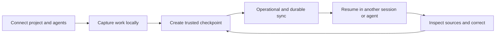

# Shoo UX Architecture and Information Architecture

- Version: 0.1
- Status: Accepted — Decision Gate 6
- Owner role: Principal Product Designer / Principal UX Architect
- Dependencies: Accepted Product Scope; PRD; Gate 5 Architecture; User Journeys
- Assumptions: Desktop-first developer workflow; OpenCode capture first and Codex continuation second; team coordination remains deferred
- Unresolved questions: Final naming comprehension for Work Unit and Durable Memory; mobile read-only demand
- Last decision: Organize Shoo around trusted work continuation rather than infrastructure, agents, or stored memory volume
- Next action: Validate navigation and terminology through tree testing and first-value usability tests

## UX goal

Reduce the effort between opening a supported coding agent and taking the first correct project action with source-backed context. Every surface must answer one of four questions:

1. What should I continue?
2. What changed and what is current?
3. Why should I trust this?
4. What action is required from me?

## Experience architecture



Shoo exposes infrastructure state only when it affects trust, recovery or user control.

## Object hierarchy

```text
Organization
└── Project
    ├── Current work
    │   └── Work unit
    │       ├── Sessions
    │       ├── Checkpoints
    │       ├── Context packs
    │       └── Relevant memories/evidence
    ├── Project knowledge
    │   ├── Decisions
    │   └── Memory records and sources
    ├── Activity
    │   └── Events, agents and sessions
    └── Settings
        ├── Connections and capture
        ├── Sync and durable memory
        ├── Access
        └── Privacy, export and deletion
```

Team, blocker, dependency and handoff objects remain in the domain model but are not exposed as active MVP navigation.

## Shoo Web primary navigation

| Navigation item | User question | MVP status | Default landing behavior |
|---|---|---|---|
| Pulse | What state is the project in, and what changed since I last looked? | MVP | Prioritized resume target, change digest and trust health |
| Work | What is active, unfinished or ready to resume? | MVP | Active and recent work units, grouped by state—not developer ranking |
| Ask Shoo | What can project evidence tell me? | MVP Slice D | Intent-led evidence query with citations |
| Activity | What happened, when, through which agent/session? | MVP | Filterable project timeline |
| Knowledge | What decisions and memories currently govern the project? | MVP | Decisions as default tab; Memory Explorer secondary |
| Settings | How is this project connected, captured, synced and controlled? | MVP | Health and required actions first |

Persistent project selector and global account menu sit outside project navigation. Search is scoped to the selected project by default.

## Secondary navigation

- Work: Active, Unfinished, Completed/History.
- Activity: Timeline, Agents & Sessions.
- Knowledge: Decisions, Memory Explorer, Conflicts.
- Settings: Project, Connections, Capture Policy, Durable Memory, Access, Privacy & Data, Diagnostics.

`Conflicts` appears as a tab only when the user has permission and at least one active/recent conflict; otherwise it is reached from affected records.

## Deferred navigation

After a new scope gate, a `Flow` area may contain Blockers, Dependencies, Handoffs and Team Pace. It must not appear disabled in MVP because that advertises unauthorized scope and adds noise. Critical-path and coordination views cannot be inferred from the solo information architecture.

## Page-question contract

| Screen | Must answer | Must not become |
|---|---|---|
| Project Pulse | What should I know and continue now? | Generic dashboard of counts |
| Work | Which bounded work is current, unfinished or historical? | Issue tracker replacement |
| Ask Shoo | What does permitted project evidence support? | General chatbot |
| Activity Timeline | What changed, through what source and with what result? | Raw transcript viewer |
| Decisions | What is current, proposed, conflicted or superseded—and why? | Flat ADR archive |
| Memory Explorer | What structured memory exists and what is its authority? | Vector database browser |
| Agents & Sessions | Is capture healthy, and which sessions contributed evidence? | Agent productivity scoreboard |
| Settings | What data leaves the machine, who controls it and how do I recover? | Infrastructure administration console |

## Information hierarchy rules

1. Required action or material risk precedes summaries.
2. Current accepted truth precedes history; unresolved conflict precedes recommendations.
3. Work outcome precedes agent/session identity.
4. Human-readable status precedes infrastructure detail.
5. Source, freshness and scope remain one interaction away from every factual claim.
6. Durable status never substitutes for authority status.
7. Counts are supporting context, not the primary Pulse content.

## Global status model

All surfaces use the same independent status dimensions:

- Capture: healthy, degraded, partial, unavailable.
- Freshness: current, stale, partial, unknown.
- Authority: observed, candidate, verified, accepted, canonical, conflicted, superseded, rejected.
- Sync: local, operational pending/synced, durable pending/confirmed/failed.
- Permission: permitted, restricted, redacted, denied.

No single “green” state collapses these dimensions.

## Responsive behavior

- Desktop (`>=1280px`): persistent navigation, main content and contextual source/action drawer.
- Compact desktop/tablet (`768–1279px`): collapsible navigation; drawer overlays content but preserves URL/state.
- Mobile (`<768px`): read/inspect/approve-reject only for MVP Web; complex conflict merge, policy editing and onboarding redirect to desktop with rationale.

## IA validation

- Tree test: locate current decision, previous session, capture problem, durable setup and export without product training.
- First-click test: resume unfinished work from Pulse.
- Terminology test: explain Work Unit, Checkpoint, Current, Durable Memory and Source.
- Scope test: participants do not interpret Work/Activity as employee performance management.
