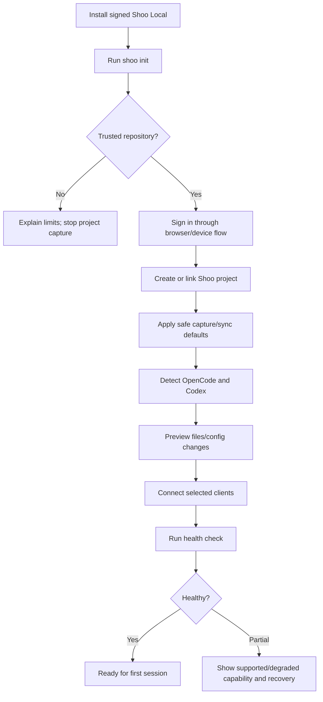
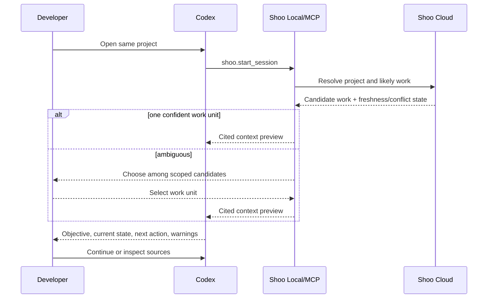

# Shoo End-to-End User Flows

- Version: 0.1
- Status: Accepted — Decision Gate 6
- Owner role: Principal UX Architect / Technical Product Manager
- Dependencies: UX Architecture; Session/Memory Lifecycles; API/MCP Contracts; Security Design
- Assumptions: Shoo Local can report health to CLI/Web; supported clients expose the Gate 5 capability manifest
- Unresolved questions: Wallet signing surface by OS; whether Codex supports equivalent context-preview placement across versions
- Last decision: Separate first local capture, first durable memory and first cross-agent continuation as measurable activation milestones
- Next action: Prototype the onboarding, resume and correction flows with OpenCode/Codex users

## Activation milestones

| Milestone | Definition | Target measurement |
|---|---|---|
| First connected project | Project identity, sign-in and at least one healthy supported client | Time from install |
| First successful memory | Eligible session evidence becomes a structured checkpoint with source | Time from project connection |
| First durable memory | Checkpoint receives verified Manual durable confirmation | Time and number of user actions |
| First cross-agent continuation | Another supported agent receives a relevant cited context pack | Time plus manual re-explanation required |

## Flow 1 — Install, initialize and connect

The configuration preview names files and permissions before modification. Shoo never claims a client is connected merely because an MCP entry exists; hook/plugin and access health are tested separately.

## Flow 2 — Set up user-owned Durable Memory

1. Explain outcome: memories selected by policy can survive Shoo Cloud and remain user-controlled.
2. Choose owner wallet; explicitly prohibit primary-key import.
3. Connect wallet and select/create MemWal account.
4. Preview project namespace and ownership.
5. Create one revocable device delegate with least scope.
6. User signs the bounded authorization.
7. Confirm recovery readiness and show the consequence of key loss.
8. Run encrypted test remember/recall.
9. Show `Durable Memory ready` only after round-trip verification.

Advanced details disclose MemWal, Walrus, namespace, epochs, locators and trust boundaries. Default copy uses `Durable Memory`, `owner wallet` and `device access`.

Failure branches:

- Wallet unavailable: keep local/operational capture and resume setup later.
- Signature rejected: no delegate; explain no data changed.
- MemWal unavailable: retain encrypted pending item and retry control.
- Namespace collision/mismatch: block write; require explicit owner/project confirmation.
- Recovery acknowledgement missing: setup remains incomplete.

## Flow 3 — First session and automatic checkpoint

1. Agent starts in trusted project.
2. Shoo identifies project, developer, client, session and candidate work unit.
3. If ambiguous, ask one targeted work-unit question; do not open a general setup form.
4. Deliver prior context or an honest empty state.
5. Capture eligible events locally under the visible policy.
6. At semantic boundary, propose/create checkpoint with objective, progress, files, tests, uncertainty and next action.
7. Show local, operational and durable states independently.
8. On completion, distinguish session ended from work completed.

## Flow 4 — Cross-agent resume

If durable storage is unavailable but operational truth is current, Shoo may resume with a visible `Durable copy pending` state. If current truth is conflicted, it presents sides before any suggestion.

## Flow 5 — Inspect and correct memory

1. User opens source from context, Ask, Decision or Memory item.
2. Source drawer shows claim type, scope, authority, source time, agent/session and permitted evidence.
3. User selects Correct, Change scope, Supersede or Mark not current.
4. Preview shows affected current truth, context packs, Ask answers and future consumers.
5. User confirms; high-impact changes require step-up.
6. Shoo commits revision, invalidates caches and displays new state plus lineage.

Stale optimistic version returns a comparison—not a destructive retry.

## Flow 6 — Ask Shoo

1. User chooses an intent or enters a project question.
2. Shoo states effective project/work/branch/time scope.
3. Response separates Facts, Inferences and Suggestions.
4. Each factual claim has citation/freshness; restricted evidence is disclosed without leakage.
5. Unknown, stale or conflict result offers scoped recovery: change timeframe, inspect sources, resolve conflict or capture missing evidence.
6. Follow-up inherits scope visibly and can be reset.

## Flow 7 — Export, deletion and uninstall

- Export: choose scope and content classes → step-up authorization → async package → expiry notice.
- Delete/restrict: preview local/operational/index/backup/durable layers → confirm → per-layer progress and residual retention truth.
- Uninstall: offer encrypted local export, revoke device delegate, disconnect clients, remove config only with preview, then remove runtime. Cloud/project deletion is a separate explicit action.

## Universal failure behavior

Every flow defines normal, empty, partial, stale, conflict, denied, offline, MemWal unavailable, duplicate, out-of-order, hallucinated/unverified, corrected and rollback outcomes. Recovery copy must identify what is safe, what is pending and what action—if any—is required.
